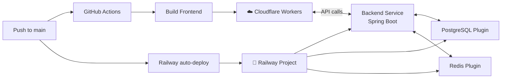

# CI/CD Pipeline — ThangLong University Web

Frontend → **Cloudflare Workers** (miễn phí) | Backend + DB + Redis → **Railway.app** ($5/month)

---

## Chuẩn Bị Trước Khi Bắt Đầu

### Tài khoản cần đăng ký

| # | Tài khoản | Link | Ghi chú |
|---|---|---|---|
| 1 | **GitHub** | [github.com](https://github.com) | Bạn đã có (repo ThangLongUniversityWeb) |
| 2 | **Railway** | [railway.app](https://railway.app) | Đăng ký bằng GitHub. Chọn **Hobby plan $5/month** |
| 3 | **Cloudflare** | [dash.cloudflare.com](https://dash.cloudflare.com) | Đăng ký miễn phí, dùng Workers |

### Thông tin cần chuẩn bị sẵn

| # | Thông tin | Cách lấy | Dùng ở đâu |
|---|---|---|---|
| 1 | **Cloudflare API Token** | Cloudflare → My Profile → API Tokens → Create Token → template "Edit Cloudflare Workers" | GitHub Secrets |
| 2 | **Cloudflare Account ID** | Cloudflare dashboard → sidebar phải → Account ID | GitHub Secrets |
| 3 | **JWT Secret Key** | Chạy `openssl rand -base64 64` trên terminal | Railway env |
| 4 | **VNPay credentials** | Giữ nguyên sandbox hoặc đăng ký production | Railway env |
| 5 | **Groq API Key** | [console.groq.com](https://console.groq.com) (nếu dùng AI chatbot) | Railway env |
| 6 | **Cloudinary credentials** | [cloudinary.com](https://cloudinary.com) (nếu dùng upload) | Railway env |

### Checklist trước khi bắt đầu

- [ ] Repo GitHub đã push code mới nhất lên nhánh `main`
- [ ] Đã đăng ký Railway → kích hoạt Hobby plan ($5/month)
- [ ] Đã đăng ký Cloudflare → lấy được API Token + Account ID
- [ ] Đã generate JWT secret key
- [ ] Đã chuẩn bị API key các dịch vụ bên ngoài (Groq, Cloudinary — nếu dùng)

---

## Kiến Trúc Tổng Quan



### Tại sao setup này tốt?

| Ưu điểm | Chi tiết |
|---|---|
| **1 chỗ quản lý backend** | Railway dashboard quản lý backend + DB + Redis — không cần SSH, không cần VPS |
| **Auto-deploy** | Railway tự detect push `main` → build Docker → deploy. Không cần viết workflow |
| **Always-on** | Không cold start, backend luôn chạy 24/7 |
| **Không lo infra** | Railway tự backup DB, tự restart khi crash, tự scale |
| **Frontend nhanh** | Cloudflare CDN edge toàn cầu, load < 100ms |

---

## Proposed Changes

### Component 1: Backend Dockerfile

#### [NEW] [Dockerfile](file:///d:/universityweb/backend/Dockerfile)

```dockerfile
# Stage 1: Build
FROM eclipse-temurin:21-jdk-alpine AS builder
WORKDIR /app
COPY gradlew gradlew.bat ./
COPY gradle/ gradle/
COPY build.gradle.kts settings.gradle.kts ./
RUN chmod +x gradlew && ./gradlew dependencies --no-daemon || true
COPY src/ src/
RUN ./gradlew bootJar --no-daemon -x test

# Stage 2: Runtime (~200MB image)
FROM eclipse-temurin:21-jre-alpine
WORKDIR /app
RUN addgroup -S app && adduser -S app -G app
COPY --from=builder /app/build/libs/*.jar app.jar
RUN chown -R app:app /app
USER app
EXPOSE 8080
ENTRYPOINT ["java", "-jar", "app.jar"]
```

#### [NEW] [.dockerignore](file:///d:/universityweb/backend/.dockerignore)

```
.git
.gradle
build/
*.env
.env*
node_modules
uploads/
docs/
*.md
sql/
```

---

### Component 2: Railway Config

#### [NEW] [railway.json](file:///d:/universityweb/backend/railway.json)

Railway config để chỉ định build từ Dockerfile và cấu hình health check:

```json
{
  "$schema": "https://railway.com/railway.schema.json",
  "build": {
    "dockerfilePath": "Dockerfile"
  },
  "deploy": {
    "healthcheckPath": "/actuator/health",
    "healthcheckTimeout": 120,
    "restartPolicyType": "ON_FAILURE",
    "restartPolicyMaxRetries": 5
  }
}
```

> [!NOTE]
> Nếu project chưa có Spring Actuator health endpoint, có thể bỏ `healthcheckPath` hoặc tạo 1 endpoint đơn giản `/api/health`.

---

### Component 3: Frontend Dockerfile (backup cho self-host)

#### [NEW] [Dockerfile](file:///d:/universityweb/frontend/Dockerfile)

```dockerfile
FROM oven/bun:latest AS builder
WORKDIR /app
COPY package.json bun.lock ./
RUN bun install --frozen-lockfile
COPY . .
ARG VITE_API_BASE_URL=http://localhost:8080
ENV VITE_API_BASE_URL=$VITE_API_BASE_URL
RUN bun run build

FROM oven/bun:latest
WORKDIR /app
RUN addgroup --system app && adduser --system --ingroup app app
COPY --from=builder /app/dist ./dist
COPY --from=builder /app/node_modules ./node_modules
COPY --from=builder /app/package.json ./
USER app
EXPOSE 3000
CMD ["bun", "run", "preview"]
```

#### [NEW] [.dockerignore](file:///d:/universityweb/frontend/.dockerignore)

```
.git
node_modules
dist
*.md
docs/
.tanstack/
```

---

### Component 4: GitHub Actions — Frontend Deploy

#### [NEW] [deploy-frontend.yml](file:///d:/universityweb/.github/workflows/deploy-frontend.yml)

```yaml
name: Deploy Frontend to Cloudflare

on:
  push:
    branches: [main]
    paths:
      - 'frontend/**'
      - '.github/workflows/deploy-frontend.yml'
  workflow_dispatch: # Cho phép chạy thủ công trên GitHub

jobs:
  deploy:
    runs-on: ubuntu-latest
    name: Build & Deploy
    defaults:
      run:
        working-directory: frontend

    steps:
      - name: Checkout code
        uses: actions/checkout@v4

      - name: Setup Bun
        uses: oven-sh/setup-bun@v2

      - name: Install dependencies
        run: bun install --frozen-lockfile

      - name: Build
        run: bun run build
        env:
          VITE_API_BASE_URL: ${{ secrets.VITE_API_BASE_URL }}

      - name: Deploy to Cloudflare Workers
        uses: cloudflare/wrangler-action@v3
        with:
          apiToken: ${{ secrets.CLOUDFLARE_API_TOKEN }}
          accountId: ${{ secrets.CLOUDFLARE_ACCOUNT_ID }}
          workingDirectory: frontend
          command: deploy
```

> [!NOTE]
> **Không cần workflow cho backend** — Railway tự động detect push lên `main` → build Dockerfile → deploy. Zero config.

---

## GitHub Secrets Cần Thêm

Vào repo → **Settings** → **Secrets and variables** → **Actions** → **New repository secret**

| Secret | Value | Dùng cho |
|---|---|---|
| `CLOUDFLARE_API_TOKEN` | Token từ Cloudflare | Frontend deploy |
| `CLOUDFLARE_ACCOUNT_ID` | Account ID từ Cloudflare | Frontend deploy |
| `VITE_API_BASE_URL` | URL backend từ Railway (ví dụ: `https://thanglong-uni-api-production.up.railway.app`) | Frontend build |

---

## Hướng Dẫn Setup Từng Bước

### 🚂 Bước 1: Setup Railway (15 phút)

#### 1.1 Tạo Project

1. Đăng nhập [railway.app](https://railway.app) bằng GitHub
2. Upgrade lên **Hobby Plan** ($5/month) tại Settings → Billing
3. Click **New Project** → **Deploy from GitHub Repo**
4. Chọn repo `ThangLongUniversityWeb`
5. Railway sẽ hỏi root directory → nhập **`backend`**
6. Railway auto-detect Dockerfile → bắt đầu build

#### 1.2 Thêm PostgreSQL

1. Trong project, click **+ New** → **Database** → **PostgreSQL**
2. Railway tự tạo DB và inject biến môi trường:
   - `DATABASE_URL` — connection string đầy đủ
   - `PGHOST`, `PGPORT`, `PGUSER`, `PGPASSWORD`, `PGDATABASE`
3. **Không cần cấu hình gì thêm**

#### 1.3 Thêm Redis

1. Click **+ New** → **Database** → **Redis**
2. Railway tự inject:
   - `REDIS_URL` — connection string đầy đủ
   - `REDISHOST`, `REDISPORT`, `REDISPASSWORD`
3. **Không cần cấu hình gì thêm**

#### 1.4 Cấu hình Environment Variables cho Backend

Click vào **Backend service** → **Variables** → **Raw Editor** → paste:

```env
# === Server ===
SERVER_PORT=8080
SPRING_APPLICATION_NAME=ThangLongUniversityWeb

# === Database (dùng biến Railway tự inject) ===
SPRING_DATASOURCE_URL=jdbc:postgresql://${{Postgres.PGHOST}}:${{Postgres.PGPORT}}/${{Postgres.PGDATABASE}}
SPRING_DATASOURCE_USERNAME=${{Postgres.PGUSER}}
SPRING_DATASOURCE_PASSWORD=${{Postgres.PGPASSWORD}}
SPRING_JPA_DDL_AUTO=update
SPRING_JPA_SHOW_SQL=false

# === Redis (dùng biến Railway tự inject) ===
SPRING_DATA_REDIS_HOST=${{Redis.REDISHOST}}
SPRING_DATA_REDIS_PORT=${{Redis.REDISPORT}}
SPRING_DATA_REDIS_PASSWORD=${{Redis.REDISPASSWORD}}

# === Kafka (disabled) ===
SPRING_KAFKA_ENABLED=false

# === JWT ===
APP_JWT_SECRET=<PASTE_YOUR_GENERATED_SECRET_HERE>

# === Frontend URL & CORS ===
APP_FRONTEND_URL=https://your-frontend.pages.dev
APP_CORS_ALLOWED_ORIGINS=https://your-frontend.pages.dev

# === Cookies (cross-origin) ===
APP_COOKIE_SECURE=true
APP_COOKIE_SAME_SITE=None

# === VNPay (sandbox) ===
VNPAY_TMN_CODE=FMQW52FA
VNPAY_HASH_SECRET=5TO45K0S1P2URJNA3FHMFNYUURLN3NJ5
VNPAY_PAYMENT_URL=https://sandbox.vnpayment.vn/paymentv2/vpcpay.html
VNPAY_RETURN_URL=https://your-backend.up.railway.app/api/payments/vnpay/return

# === External Services (điền nếu dùng) ===
GROQ_API_KEY=
CLOUDINARY_CLOUD_NAME=
CLOUDINARY_API_KEY=
CLOUDINARY_API_SECRET=
HUGGINGFACE_API_KEY=
```

> [!TIP]
> Cú pháp `${{Postgres.PGHOST}}` là **Railway variable reference** — Railway tự động thay bằng giá trị thật của PostgreSQL plugin. Không cần hardcode connection string.

#### 1.5 Expose Backend Port

1. Click vào Backend service → **Settings** → **Networking**
2. Click **Generate Domain** → Railway tạo URL dạng `https://xxx-production.up.railway.app`
3. Hoặc sau khi mua domain: **Custom Domain** → thêm `api.yourdomain.com`
4. **Lưu lại URL này** — dùng cho bước sau

---

### ☁️ Bước 2: Setup Cloudflare + Frontend (10 phút)

#### 2.1 Lấy API Token

1. Đăng nhập [dash.cloudflare.com](https://dash.cloudflare.com)
2. **My Profile** (góc phải) → **API Tokens** → **Create Token**
3. Chọn template **"Edit Cloudflare Workers"**
4. Permissions: thêm **Account > Cloudflare Pages > Edit**
5. Click **Continue** → **Create Token** → Copy token

#### 2.2 Lấy Account ID

1. Trên dashboard Cloudflare → sidebar phải → **Account ID**
2. Copy

#### 2.3 Thêm GitHub Secrets

1. Vào repo GitHub → **Settings** → **Secrets and variables** → **Actions**
2. Thêm 3 secrets:
   - `CLOUDFLARE_API_TOKEN` = token từ 2.1
   - `CLOUDFLARE_ACCOUNT_ID` = ID từ 2.2
   - `VITE_API_BASE_URL` = URL backend từ Railway (bước 1.5)

#### 2.4 Deploy

Push code lên `main` → GitHub Actions tự chạy → frontend deploy lên Cloudflare Workers

---

### 🌐 Bước 3: Custom Domain (sau khi mua)

1. **Thêm domain vào Cloudflare** → đổi nameserver tại nhà đăng ký domain
2. **Frontend**: Workers & Pages → Custom Domains → `yourdomain.com`
3. **Backend**: Trên Cloudflare DNS, tạo CNAME record:
   - Name: `api`
   - Target: `xxx-production.up.railway.app`
   - Proxy: OFF (DNS only, vì Railway tự cấp SSL)
4. Trên Railway: Settings → Custom Domain → `api.yourdomain.com`
5. Cập nhật env variables:
   - Railway: `APP_FRONTEND_URL` = `https://yourdomain.com`
   - Railway: `APP_CORS_ALLOWED_ORIGINS` = `https://yourdomain.com`
   - GitHub Secret: `VITE_API_BASE_URL` = `https://api.yourdomain.com`

---

## Tóm Tắt Files Cần Tạo

| # | File | Mục đích |
|---|---|---|
| 1 | `backend/Dockerfile` | Build Spring Boot image cho Railway |
| 2 | `backend/.dockerignore` | Tối ưu Docker build |
| 3 | `backend/railway.json` | Cấu hình Railway deploy + health check |
| 4 | `frontend/Dockerfile` | Backup cho self-host (không bắt buộc) |
| 5 | `frontend/.dockerignore` | Tối ưu Docker build |
| 6 | `.github/workflows/deploy-frontend.yml` | Auto-deploy frontend → Cloudflare |

---

## Chi Phí Hàng Tháng

| Dịch vụ | Chi phí |
|---|---|
| Railway Hobby Plan | $5/month (bao gồm backend + PostgreSQL + Redis) |
| Cloudflare Workers | $0 (free tier: 100K req/day) |
| GitHub Actions | $0 (free: 2000 minutes/month cho public repo) |
| **Tổng** | **$5/month** |

---

## Verification Plan

### Sau khi tạo files & push lên main
1. ✅ Railway auto-detect → build Dockerfile → deploy backend thành công
2. ✅ GitHub Actions → build frontend → deploy Cloudflare Workers thành công
3. ✅ Truy cập Railway URL `/swagger-ui.html` → Swagger hiển thị
4. ✅ Truy cập Cloudflare URL → frontend load đúng
5. ✅ Frontend gọi API backend → dữ liệu trả về đúng (CORS OK)
