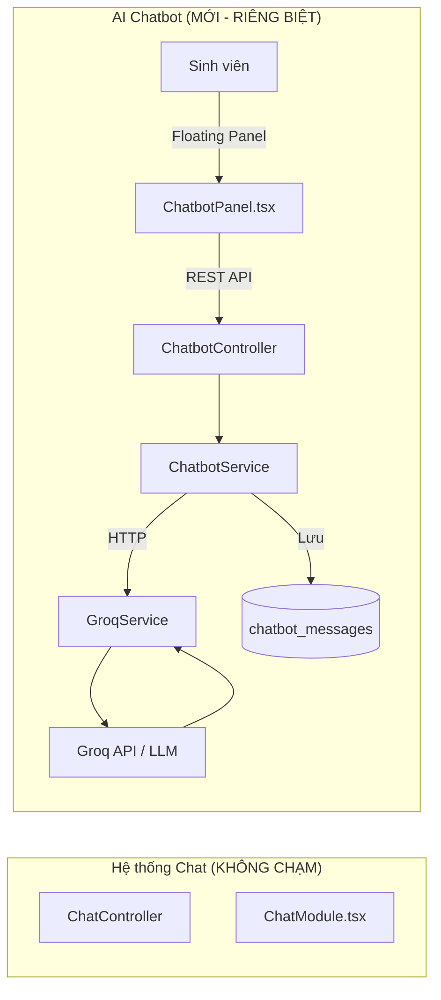
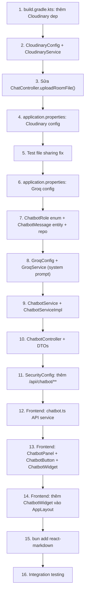

# Kế hoạch triển khai: AI Chatbot TLU & Sửa lỗi chia sẻ file

## Tổng quan

Có **2 vấn đề** cần giải quyết:

1. **Bug chia sẻ file trong chat**: File lưu local, người nhận bấm link mở tab mới → browser không gửi JWT → 401/không xem được
2. **Xây dựng AI Chatbot**: Tích hợp "Trợ lý Sinh viên TLU" sử dụng Groq API — **feature hoàn toàn riêng biệt**, không liên quan đến hệ thống chat hiện tại

### Tech Stack hiện tại

| Layer | Stack |
|---|---|
| Backend | Spring Boot 4.0.2, Java 21, Gradle, PostgreSQL, Redis, WebSocket STOMP |
| Frontend | React 19, TanStack Start (SSR), TypeScript, Tailwind CSS 4, shadcn/ui, Vite 7 |
| Chat | REST `/api/chat/*` + WebSocket STOMP — **đã hoàn chỉnh, không chạm vào** |

---

## Phần 1: Sửa lỗi chia sẻ file trong Chat

### Phân tích nguyên nhân gốc

Trong [ChatController.java](file:///d:/universityweb/backend/src/main/java/com/example/ThangLongUniversityWeb/controller/ChatController.java) (line 134-165):

1. File upload → lưu vào `uploads/chat/{roomId}/{uuid-filename}` trên local filesystem
2. `mediaUrl` set thành `/api/chat/files/{roomId}/{encodedName}`
3. Frontend [ChatModule.tsx](file:///d:/universityweb/frontend/src/features/chat/ChatModule.tsx) (line 66-69) dùng `mediaHref()` prefix `API_BASE_URL` → URL cuối: `http://localhost:8080/api/chat/files/{roomId}/{fileName}`
4. Endpoint download tồn tại (line 167-181) nhưng **`/api/chat/**` requires role STUDENT/TEACHER/ADMIN** trong [SecurityConfig.java](file:///d:/universityweb/backend/src/main/java/com/example/ThangLongUniversityWeb/config/SecurityConfig.java) (line 115)
5. **Khi user bấm link → browser mở tab mới → KHÔNG gửi JWT token → 401 Unauthorized**

### Giải pháp: Upload file lên Cloudinary

Thay vì lưu file local, upload lên Cloudinary để nhận public URL.

**Cloudinary credentials:**
- `cloud_name`: lay tu Cloudinary Dashboard, vi du `drdim9z1v`
- `api_key`: `922634196268182`
- `api_secret`: `dtBJsk3Cy_GEatZp27TQPL6HY-s`

### Proposed Changes — File Bug Fix

---

#### [MODIFY] [build.gradle.kts](file:///d:/universityweb/backend/build.gradle.kts)

Thêm Cloudinary dependency:
```diff
+ implementation("com.cloudinary:cloudinary-http45:1.39.0")
```

---

#### [NEW] `CloudinaryConfig.java`
**Path**: `backend/src/main/java/com/example/ThangLongUniversityWeb/config/CloudinaryConfig.java`

- Đọc `cloudinary.cloud-name`, `cloudinary.api-key`, `cloudinary.api-secret` từ properties
- Tạo `Cloudinary` bean

---

#### [NEW] `CloudinaryService.java`
**Path**: `backend/src/main/java/com/example/ThangLongUniversityWeb/service/CloudinaryService.java`

```java
@Service
public class CloudinaryService {
    private final Cloudinary cloudinary;
    
    public String uploadFile(MultipartFile file) {
        Map result = cloudinary.uploader().upload(file.getBytes(), 
            ObjectUtils.asMap("resource_type", "auto"));
        return result.get("secure_url").toString();
    }
}
```

---

#### [MODIFY] [ChatController.java](file:///d:/universityweb/backend/src/main/java/com/example/ThangLongUniversityWeb/controller/ChatController.java)

Thay đổi method `uploadRoomFile` (line 134-165):

```diff
  @PostMapping(value = "/rooms/{roomId}/files", consumes = MediaType.MULTIPART_FORM_DATA_VALUE)
  public ResponseEntity<ChatMessageResponse> uploadRoomFile(...) {
-     // Logic lưu file local vào uploads/chat/{roomId}/
-     Path dir = Path.of("uploads", "chat", ...);
-     file.transferTo(target);
-     String encodedName = ...;
-     .mediaUrl("/api/chat/files/" + roomId + "/" + encodedName)
+     // Upload lên Cloudinary, nhận public URL
+     String secureUrl = cloudinaryService.uploadFile(file);
+     .mediaUrl(secureUrl)
      .fileName(originalName)
      .fileSize(file.getSize())
  }
```

Giữ lại endpoint `GET /files/{roomId}/{fileName}` (line 167-181) cho backward compatibility với file cũ đã lưu local.

---

#### Frontend — Không cần thay đổi

Frontend [ChatModule.tsx](file:///d:/universityweb/frontend/src/features/chat/ChatModule.tsx) line 66-69:
```typescript
function mediaHref(url?: string | null) {
  if (!url) return "#";
  return url.startsWith("http") ? url : `${API_BASE_URL}${url}`;
}
```
Cloudinary URL bắt đầu bằng `https://` → `mediaHref()` trả về nguyên URL → **tự động hoạt động, không cần sửa FE**.

---

#### [MODIFY] [application.properties](file:///d:/universityweb/backend/src/main/resources/application.properties)

```properties
# ===============================
# CLOUDINARY
# ===============================
cloudinary.cloud-name=${CLOUDINARY_CLOUD_NAME:}
cloudinary.api-key=${CLOUDINARY_API_KEY:}
cloudinary.api-secret=${CLOUDINARY_API_SECRET:}
```

---

## Phần 2: Xây dựng AI Chatbot "Trợ lý Sinh viên TLU"

> [!IMPORTANT]
> Chatbot là **feature hoàn toàn riêng biệt** — không chạm vào hệ thống chat hiện tại (`ChatController`, `ChatModule.tsx`, `ChatRoom`, `Message`, v.v.). Chatbot có entity riêng, controller riêng, UI riêng.

### Kiến trúc



### Groq API Integration

- **API Key**: lấy từ biến môi trường `GROQ_API_KEY` (không commit key thật)
- **Model**: `llama-3.3-70b-versatile`
- **Endpoint**: `POST https://api.groq.com/openai/v1/chat/completions` (OpenAI-compatible)
- **System Prompt**: Bản "Siêu prompt tiếng Việt" từ [deep-research-report.md](file:///d:/universityweb/backend/docs/deep-research-report.md) (line 116-244)
- **Temperature**: 0.3 (câu trả lời chính xác, ít sáng tạo)
- **Max tokens**: 2048

### Proposed Changes — AI Chatbot

---

### Backend Changes

#### [NEW] `ChatbotMessage.java` (Entity)
**Path**: `backend/src/main/java/com/example/ThangLongUniversityWeb/entity/ChatbotMessage.java`

```java
@Entity
@Table(name = "chatbot_messages", indexes = {
    @Index(name = "idx_chatbot_user_session", columnList = "user_id, session_id")
})
public class ChatbotMessage {
    @Id @GeneratedValue(strategy = GenerationType.IDENTITY)
    private Long id;
    
    @ManyToOne(fetch = FetchType.LAZY)
    @JoinColumn(name = "user_id", nullable = false)
    private User user;
    
    @Enumerated(EnumType.STRING)
    private ChatbotRole role;    // USER, ASSISTANT
    
    @Column(columnDefinition = "TEXT", nullable = false)
    private String content;
    
    private String sessionId;
    
    @Column(updatable = false)
    @Builder.Default
    private LocalDateTime createdAt = LocalDateTime.now();
}
```

#### [NEW] `ChatbotRole.java` (Enum)
**Path**: `backend/src/main/java/com/example/ThangLongUniversityWeb/enums/ChatbotRole.java`
```java
public enum ChatbotRole { USER, ASSISTANT }
```

#### [NEW] `ChatbotMessageRepository.java`
**Path**: `backend/src/main/java/com/example/ThangLongUniversityWeb/repository/ChatbotMessageRepository.java`

- `findByUserAndSessionIdOrderByCreatedAtDesc(user, sessionId, pageable)` → lấy N messages gần nhất cho context
- `findByUserAndSessionIdOrderByCreatedAtAsc(user, sessionId)` → lấy toàn bộ history
- `deleteByUserAndSessionId(user, sessionId)` → xóa history

#### [NEW] `GroqConfig.java`
**Path**: `backend/src/main/java/com/example/ThangLongUniversityWeb/config/GroqConfig.java`

- Đọc cấu hình Groq từ properties
- Tạo `RestClient` bean cho HTTP calls tới Groq API

#### [NEW] `GroqService.java`
**Path**: `backend/src/main/java/com/example/ThangLongUniversityWeb/service/GroqService.java`

- Build request: `{ model, messages: [{role:"system", content:SYSTEM_PROMPT}, ...history, {role:"user", content:msg}], temperature, max_tokens }`
- Call `POST https://api.groq.com/openai/v1/chat/completions`
- Parse response → `choices[0].message.content`
- Error handling: timeout, rate limit, fallback message
- System prompt constant: bản đầy đủ từ research report

#### [NEW] `ChatbotService.java` (interface)
**Path**: `backend/src/main/java/com/example/ThangLongUniversityWeb/service/ChatbotService.java`

```java
public interface ChatbotService {
    ChatbotResponse sendMessage(String message, String sessionId);
    List<ChatbotMessageResponse> getHistory(String sessionId);
    void clearHistory(String sessionId);
}
```

#### [NEW] `ChatbotServiceImpl.java`
**Path**: `backend/src/main/java/com/example/ThangLongUniversityWeb/service/impl/ChatbotServiceImpl.java`

Flow:
1. Get authenticated user từ SecurityContext
2. Lưu user message vào DB (bảng `chatbot_messages`)
3. Load 20 messages gần nhất làm conversation history
4. Gọi `groqService.chat(systemPrompt, history, userMessage)`
5. Lưu assistant response vào DB
6. Trả response cho client

#### [NEW] `ChatbotController.java`
**Path**: `backend/src/main/java/com/example/ThangLongUniversityWeb/controller/ChatbotController.java`

```java
@RestController
@RequestMapping("/api/chatbot")
@RequiredArgsConstructor
public class ChatbotController {
    
    @PostMapping("/send")
    public ResponseEntity<ChatbotResponse> send(@RequestBody ChatbotRequest request) { }
    
    @GetMapping("/history")
    public ResponseEntity<List<ChatbotMessageResponse>> getHistory(
        @RequestParam(required = false) String sessionId) { }
    
    @DeleteMapping("/history")
    public ResponseEntity<Void> clearHistory(
        @RequestParam(required = false) String sessionId) { }
}
```

#### [NEW] DTOs
- `ChatbotRequest.java` — `{ message: String, sessionId?: String }`
- `ChatbotResponse.java` — `{ answer: String, sessionId: String, timestamp: LocalDateTime }`
- `ChatbotMessageResponse.java` — `{ id, role, content, createdAt }`

**Path**: `backend/src/main/java/com/example/ThangLongUniversityWeb/dto/request/ChatbotRequest.java`
**Path**: `backend/src/main/java/com/example/ThangLongUniversityWeb/dto/response/ChatbotResponse.java`
**Path**: `backend/src/main/java/com/example/ThangLongUniversityWeb/dto/response/ChatbotMessageResponse.java`

#### [MODIFY] [SecurityConfig.java](file:///d:/universityweb/backend/src/main/java/com/example/ThangLongUniversityWeb/config/SecurityConfig.java)

Thêm 1 dòng rule cho chatbot API:

```diff
  .requestMatchers("/api/chat/**").hasAnyRole("STUDENT", "TEACHER", "ADMIN")
+ .requestMatchers("/api/chatbot/**").hasAnyRole("STUDENT", "TEACHER", "ADMIN")
```

#### [MODIFY] [application.properties](file:///d:/universityweb/backend/src/main/resources/application.properties)

```properties
# ===============================
# GROQ AI CONFIGURATION
# ===============================
groq.api.key=${GROQ_API_KEY:}
groq.api.base-url=https://api.groq.com/openai/v1
groq.api.model=llama-3.3-70b-versatile
groq.api.max-tokens=2048
groq.api.temperature=0.3
```

---

### Frontend Changes

> [!NOTE]
> Toàn bộ chatbot UI nằm trong `src/features/chatbot/` — **không chạm vào** `src/features/chat/` hay bất cứ file chat hiện tại nào.

#### [NEW] `chatbot.ts` (API Service)
**Path**: `frontend/src/lib/api/chatbot.ts`

```typescript
import { apiRequest } from "./client";

export interface ChatbotMessageItem {
  id: number;
  role: "USER" | "ASSISTANT";
  content: string;
  createdAt: string;
}

export interface ChatbotResponse {
  answer: string;
  sessionId: string;
  timestamp: string;
}

export function sendChatbotMessage(message: string, sessionId?: string) {
  return apiRequest<ChatbotResponse>("/api/chatbot/send", {
    method: "POST",
    body: JSON.stringify({ message, sessionId }),
  });
}

export function getChatbotHistory(sessionId?: string) {
  const params = sessionId ? `?sessionId=${sessionId}` : "";
  return apiRequest<ChatbotMessageItem[]>(`/api/chatbot/history${params}`);
}

export function clearChatbotHistory(sessionId?: string) {
  const params = sessionId ? `?sessionId=${sessionId}` : "";
  return apiRequest<void>(`/api/chatbot/history${params}`, { method: "DELETE" });
}
```

#### [NEW] `ChatbotPanel.tsx` (Main chatbot component)
**Path**: `frontend/src/features/chatbot/ChatbotPanel.tsx`

Floating panel overlay ở góc phải dưới (khoảng 400×560px):
- **Header**: Avatar bot + "Trợ lý Sinh viên TLU" + nút minimize + nút xóa lịch sử
- **Message area**: ScrollArea (shadcn), bubble messages phân biệt user/bot
- **Bot responses**: Render markdown (thêm `react-markdown` dependency)
- **Typing indicator**: Animation 3 dots khi chờ AI response
- **Input area**: Input (shadcn) + Button send, Enter to send
- **Session**: Tự tạo `sessionId` (UUID) khi lần đầu mở, lưu trong state
- **Style**: shadcn/ui components + Tailwind CSS, khớp design system hiện tại

#### [NEW] `ChatbotButton.tsx` (Floating Action Button)
**Path**: `frontend/src/features/chatbot/ChatbotButton.tsx`

- Nút tròn fixed ở góc phải dưới (`bottom-6 right-6`)
- Icon `Bot` từ lucide-react
- Click → toggle hiện/ẩn `ChatbotPanel`
- Pulse animation subtle

#### [MODIFY] [AppLayout.tsx](file:///d:/universityweb/frontend/src/components/layout/AppLayout.tsx)

Thêm chatbot vào layout (chỉ 2 dòng import + 1 component):

```diff
+ import { ChatbotWidget } from "@/features/chatbot/ChatbotWidget";

  // Cuối return JSX, trước closing </div>:
+ <ChatbotWidget />
```

#### [NEW] `ChatbotWidget.tsx` (Wrapper)
**Path**: `frontend/src/features/chatbot/ChatbotWidget.tsx`

Wrapper component quản lý state mở/đóng, bao gồm cả `ChatbotButton` + `ChatbotPanel`.

#### Dependencies (frontend)

```bash
bun add react-markdown
```

---

## Phần 3 (Tương lai): RAG — Retrieval Augmented Generation

> [!NOTE]
> Phase này thực hiện **sau khi Phase 1+2 hoàn tất và hoạt động ổn**. Dưới đây là task list đầy đủ để Sonnet có thể follow từng bước.

### Mục tiêu RAG

Thay vì chỉ dùng system prompt tĩnh, chatbot sẽ:
1. Crawl + parse nội dung website TLU + Sổ tay sinh viên → lưu thành document chunks
2. Khi nhận câu hỏi → tìm document chunks liên quan nhất (semantic search)
3. Đưa chunks vào prompt làm context → LLM trả lời chính xác hơn

### Task list chi tiết cho Sonnet

---

#### Task 3.1: Thiết kế database cho RAG knowledge base

- [ ] Tạo entity `KnowledgeDocument.java`:
  ```java
  @Entity
  @Table(name = "knowledge_documents")
  public class KnowledgeDocument {
      Long id;
      String title;              // Tên tài liệu/trang
      String sourceUrl;          // URL gốc (VD: thanglong.edu.vn/tuyen-sinh)
      String sourceType;         // WEBSITE, STUDENT_HANDBOOK, ANNOUNCEMENT, DEPARTMENT_PAGE
      String rawContent;         // Nội dung gốc (TEXT)
      LocalDateTime fetchedAt;   // Thời điểm crawl
      LocalDateTime documentDate; // Ngày của tài liệu (nếu có)
      int priority;              // Theo truth hierarchy: 1=cao nhất, 5=thấp nhất
      boolean isActive;
  }
  ```

- [ ] Tạo entity `KnowledgeChunk.java`:
  ```java
  @Entity
  @Table(name = "knowledge_chunks")
  public class KnowledgeChunk {
      Long id;
      @ManyToOne KnowledgeDocument document;
      String chunkText;          // Đoạn text (500-1000 tokens)
      int chunkIndex;            // Vị trí trong document
      @Column(columnDefinition = "vector(1536)")
      float[] embedding;         // Vector embedding cho semantic search
      String metadata;           // JSON: ngành, phòng ban, năm học, loại câu hỏi...
  }
  ```

- [ ] Tạo `KnowledgeDocumentRepository.java`
- [ ] Tạo `KnowledgeChunkRepository.java` với native query cho vector similarity search
- [ ] Thêm dependency `pgvector` vào `build.gradle.kts` và enable pgvector extension trong PostgreSQL
- [ ] Tạo Flyway migration cho 2 bảng mới + pgvector extension

---

#### Task 3.2: Xây dựng Embedding Service

- [ ] Tạo `EmbeddingService.java`:
  - Gọi Groq/OpenAI Embedding API hoặc dùng model embedding miễn phí (VD: `sentence-transformers` qua HuggingFace API)
  - Method: `float[] embed(String text)` — chuyển text thành vector
  - Method: `List<float[]> embedBatch(List<String> texts)` — batch embedding
  - Config: model name, dimension, batch size trong application.properties
  - Fallback: nếu embedding API lỗi, log và skip

---

#### Task 3.3: Xây dựng Document Ingestion Pipeline

- [ ] Tạo `DocumentIngestionService.java`:
  - Method: `ingestFromText(title, content, sourceUrl, sourceType, priority)` — nhận text thô, chunk, embed, lưu DB
  - Chunking strategy: split theo heading/paragraph, mỗi chunk ~500-800 tokens, overlap 100 tokens
  - Gọi `EmbeddingService.embedBatch()` cho tất cả chunks
  - Lưu document + chunks vào DB

- [ ] Tạo `TextChunker.java`:
  - Split text theo headings (##, ###) trước
  - Nếu section quá dài, split tiếp theo paragraph
  - Giữ heading context trong mỗi chunk (prefix heading vào chunk)
  - Overlap: 100 tokens cuối chunk trước = đầu chunk sau

- [ ] Tạo `DocumentIngestionController.java` (chỉ cho ADMIN):
  ```java
  @PostMapping("/api/admin/knowledge/ingest")       // Ingest text thủ công
  @PostMapping("/api/admin/knowledge/ingest-url")    // Crawl + ingest từ URL
  @GetMapping("/api/admin/knowledge/documents")      // List documents
  @DeleteMapping("/api/admin/knowledge/documents/{id}") // Xóa document + chunks
  ```

---

#### Task 3.4: Xây dựng Retriever Service

- [ ] Tạo `RetrieverService.java`:
  - Method: `List<KnowledgeChunk> retrieve(String query, int topK)`:
    1. Embed query text
    2. Vector similarity search trong `knowledge_chunks` (cosine similarity)
    3. Trả về top-K chunks, sắp xếp theo similarity score
  - Method: `List<KnowledgeChunk> retrieveWithReranking(String query, int topK)`:
    1. Retrieve top 2*K chunks
    2. Re-rank theo: similarity score × document priority × recency
    3. Trả về top-K sau re-rank
  - Truth hierarchy re-ranking weights (theo research report):
    - Priority 1 (thông báo mới): weight 1.0
    - Priority 2 (trang phòng ban): weight 0.9
    - Priority 3 (trang ngành): weight 0.85
    - Priority 4 (Sổ tay SV): weight 0.75
    - Priority 5 (Wikipedia): weight 0.5

---

#### Task 3.5: Tích hợp RAG vào ChatbotService

- [ ] Sửa `ChatbotServiceImpl.sendMessage()`:
  ```
  Flow mới:
  1. Nhận user message
  2. Gọi RetrieverService.retrieveWithReranking(message, topK=5)
  3. Build retrieved_context string từ chunks (format: "Nguồn: {title}\n{text}\n---")
  4. Inject vào prompt: system_prompt + "\n\nDỮ LIỆU THAM KHẢO:\n" + retrieved_context
  5. Gọi GroqService với prompt đã có context
  6. Lưu + trả response
  ```

- [ ] Sửa `GroqService.java`:
  - Thêm method `chatWithContext(systemPrompt, retrievedContext, history, userMessage)`
  - Tách biệt system prompt và retrieved context thành 2 system messages hoặc 1 system message ghép

---

#### Task 3.6: Seed dữ liệu ban đầu

- [ ] Tạo script/command để ingest dữ liệu từ research report:
  - Thông tin tuyển sinh 2026 (10 lĩnh vực, 25 ngành)
  - Thông tin từng ngành: mã ngành, tổ hợp, học phí, điểm chuẩn
  - Thông tin phòng ban: tên, chức năng, liên hệ (phone, email, phòng)
  - Quy định từ Sổ tay sinh viên: đăng ký học, thi, học phí, học bổng, cảnh báo, tốt nghiệp
  - Lịch sử trường, địa chỉ, hotline
  - Gán priority theo truth hierarchy

- [ ] Tạo `DataSeederKnowledge.java` hoặc admin API endpoint để bulk ingest
- [ ] Seed từ file markdown/JSON chứa sẵn dữ liệu đã chuẩn hóa

---

#### Task 3.7: Caching và tối ưu

- [ ] Semantic cache cho câu hỏi lặp:
  - Embed câu hỏi → so với cache entries → nếu similarity > 0.95 → trả cache
  - Tạo entity `ChatbotCache.java`: `{ queryEmbedding, answer, createdAt, hitCount }`
  - TTL: FAQ cache 24h, thông báo cache 6h

- [ ] Rate limit riêng cho chatbot:
  - Dùng Bucket4j (đã có): 50 messages/user/ngày
  - Config trong application.properties

---

#### Task 3.8: Admin UI cho Knowledge Management

- [ ] Tạo route `/admin/knowledge` trong frontend
- [ ] Trang list documents: data-table hiển thị title, source, priority, chunks count, fetched date
- [ ] Nút "Thêm tài liệu": form nhập title + content hoặc URL
- [ ] Nút "Xóa" từng document
- [ ] Nút "Re-index all": re-chunk + re-embed toàn bộ

---

#### Task 3.9: Web Crawler (Optional)

- [ ] Tạo `WebCrawlerService.java`:
  - Crawl URL → extract text (dùng Jsoup)
  - Thêm dependency: `implementation("org.jsoup:jsoup:1.18.3")`
  - Method: `String crawlAndExtract(String url)` — fetch HTML, loại bỏ nav/footer/scripts, extract main content
  - Danh sách URL cần crawl:
    - `thanglong.edu.vn/gioi-thieu`
    - `thanglong.edu.vn/tuyen-sinh-*`
    - Các trang phòng ban
    - Các trang ngành đào tạo
  - Cron job refresh: chạy weekly hoặc manual trigger

---

#### Task 3.10: Testing RAG

- [ ] Test retrieval accuracy: câu hỏi "học phí ngành AI" → chunk về ngành AI được trả về top-1
- [ ] Test truth hierarchy: nếu có 2 chunks (thông báo mới + sổ tay cũ), thông báo mới rank cao hơn
- [ ] Test end-to-end: hỏi chatbot → response chứa thông tin từ retrieved chunks
- [ ] Test fallback: hỏi điều không có trong knowledge base → bot nói "không xác định"
- [ ] Test edge cases: câu hỏi mơ hồ, câu hỏi thiếu ngành/năm → bot hỏi lại

---

## Verification Plan (Phase 1+2)

### Automated Tests

1. **File sharing fix**:
   - Upload file trong chat → kiểm tra `mediaUrl` trong response là Cloudinary URL (`https://res.cloudinary.com/<cloud_name>/...`)
   - Mở Cloudinary URL trong browser incognito → file accessible (không cần auth)
   - Test các loại: `.txt`, `.pdf`, `.png`, `.mp4`

2. **AI Chatbot**:
   - `POST /api/chatbot/send` với JWT → nhận response từ Groq
   - `POST /api/chatbot/send` không có JWT → 401
   - Hỏi "Trường có ngành AI không?" → response chứa thông tin đúng
   - Multi-turn: hỏi tiếp "học phí bao nhiêu?" → bot giữ context ngành AI
   - `GET /api/chatbot/history` → trả về lịch sử đúng thứ tự
   - `DELETE /api/chatbot/history` → xóa thành công, history rỗng
   - Groq API timeout/error → trả fallback message thay vì 500

### Manual Verification

1. **File sharing**: Login 2 tài khoản khác nhau, gửi file từ tài khoản A, tài khoản B bấm link → file mở được trong tab mới
2. **Chatbot**: Bấm floating button → panel hiện, gửi câu hỏi → response hiển thị đẹp với markdown, typing indicator mượt

---

## Thứ tự thực hiện



Ước lượng: ~4-6 giờ implementation cho Phase 1+2.
