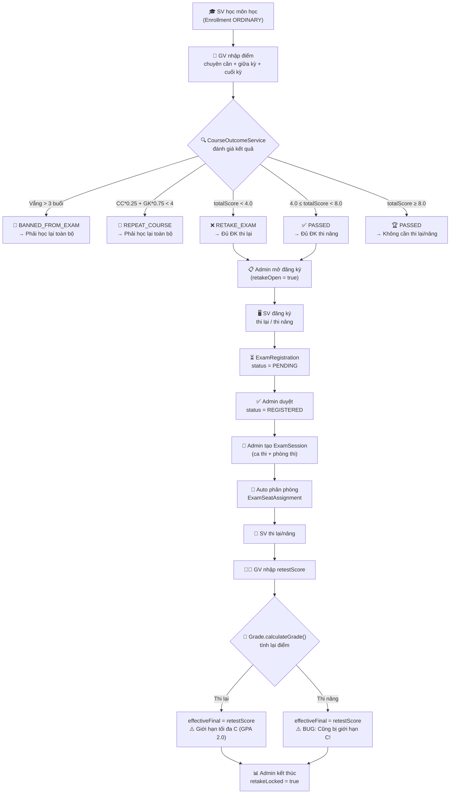
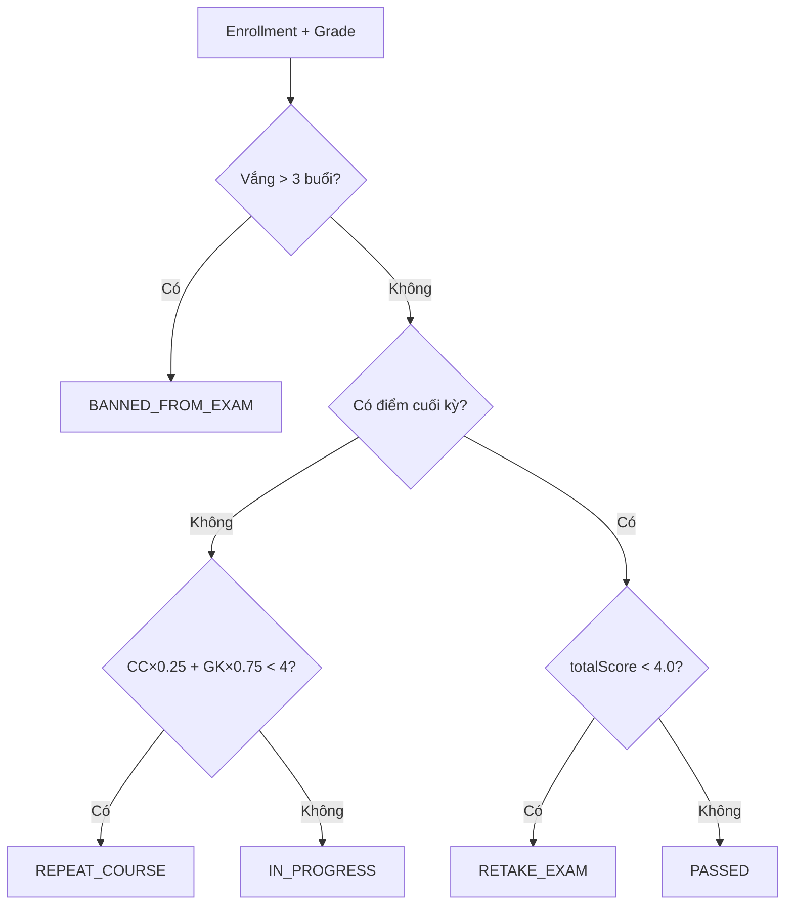
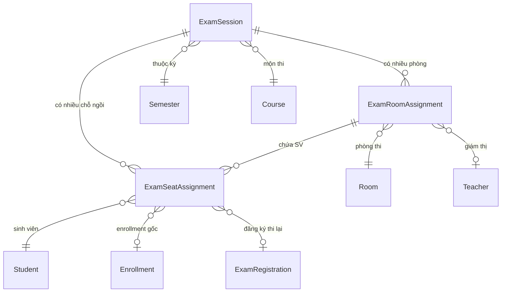

# 📋 Phân Tích Toàn Diện: Flow Thi Lại & Thi Nâng Điểm

> **Dự án**: ThangLong University Web  
> **Ngày phân tích**: 2026-06-18  
> **Phạm vi**: Backend (Java/Spring Boot) + Frontend (React/TypeScript)  
> **Số file đã phân tích**: ~50 files

---

## 1. Tổng Quan Hệ Thống

### 1.1 Các khái niệm chính

| Khái niệm | Mô tả | Enum/Entity |
|-----------|--------|-------------|
| **Thi lại (RETAKE)** | Sinh viên trượt môn (totalScore < 4.0), chỉ thi lại bài cuối kỳ | `EnrollmentType.RETAKE` |
| **Thi nâng điểm (IMPROVE)** | Sinh viên đã qua (≥ 4.0) nhưng muốn cải thiện (< 8.0) | `EnrollmentType.IMPROVE` |
| **Học lại (REPEAT_COURSE)** | Sinh viên bị buộc học lại toàn bộ môn (chuyên cần+giữa kỳ quá thấp) | `CourseStudyStatus.REPEAT_COURSE` |
| **Cấm thi (BANNED)** | Vắng > 3 buổi → không được thi cuối kỳ | `CourseStudyStatus.BANNED_FROM_EXAM` |

### 1.2 Files liên quan chính

**Backend - Enums:**
- [ExamType.java](file:///d:/universityweb/backend/src/main/java/com/example/ThangLongUniversityWeb/enums/ExamType.java) — `NORMAL`, `RETAKE`, `IMPROVE`
- [CourseStudyStatus.java](file:///d:/universityweb/backend/src/main/java/com/example/ThangLongUniversityWeb/enums/CourseStudyStatus.java) — `IN_PROGRESS`, `PASSED`, `BANNED_FROM_EXAM`, `REPEAT_COURSE`, `RETAKE_EXAM`
- [EnrollmentType.java](file:///d:/universityweb/backend/src/main/java/com/example/ThangLongUniversityWeb/enums/EnrollmentType.java) — `ORDINARY`, `RETAKE`, `IMPROVE`

**Backend - Entities:**
- [Grade.java](file:///d:/universityweb/backend/src/main/java/com/example/ThangLongUniversityWeb/entity/Grade.java) — Logic tính điểm tự động
- [ExamRegistration.java](file:///d:/universityweb/backend/src/main/java/com/example/ThangLongUniversityWeb/entity/ExamRegistration.java) — Đơn đăng ký thi lại
- [ExamSession.java](file:///d:/universityweb/backend/src/main/java/com/example/ThangLongUniversityWeb/entity/ExamSession.java) — Ca thi
- [Semester.java](file:///d:/universityweb/backend/src/main/java/com/example/ThangLongUniversityWeb/entity/Semester.java) — Lifecycle học kỳ

**Backend - Services:**
- [StudentRetakeService.java](file:///d:/universityweb/backend/src/main/java/com/example/ThangLongUniversityWeb/service/StudentRetakeService.java) — Core logic đăng ký
- [GradeService.java](file:///d:/universityweb/backend/src/main/java/com/example/ThangLongUniversityWeb/service/GradeService.java) — Nhập/tính điểm
- [ExamSessionService.java](file:///d:/universityweb/backend/src/main/java/com/example/ThangLongUniversityWeb/service/ExamSessionService.java) — Quản lý ca thi & phân phòng
- [CourseOutcomeService.java](file:///d:/universityweb/backend/src/main/java/com/example/ThangLongUniversityWeb/service/CourseOutcomeService.java) — Xác định trạng thái qua/trượt

**Backend - Controllers:**
- [StudentRetakeController.java](file:///d:/universityweb/backend/src/main/java/com/example/ThangLongUniversityWeb/controller/StudentRetakeController.java) — API cho sinh viên
- [TeacherGradeController.java](file:///d:/universityweb/backend/src/main/java/com/example/ThangLongUniversityWeb/controller/TeacherGradeController.java) — API cho giảng viên nhập điểm

**Frontend:**
- [student.retake-registration.tsx](file:///d:/universityweb/frontend/src/routes/student.retake-registration.tsx) — UI đăng ký thi lại
- [RetakeRegistrationsTab.tsx](file:///d:/universityweb/frontend/src/features/semester-hub/RetakeRegistrationsTab.tsx) — Admin quản lý đăng ký
- [ExamSchedulesTab.tsx](file:///d:/universityweb/frontend/src/features/semester-hub/ExamSchedulesTab.tsx) — Admin quản lý lịch thi
- [TeacherGradeTable.tsx](file:///d:/universityweb/frontend/src/features/teacher/TeacherGradeTable.tsx) — Bảng nhập điểm

---

## 2. Flow Toàn Bộ (Chi Tiết)

### 2.1 Sơ Đồ Tổng Quan



### 2.2 Flow Chi Tiết Từng Bước

---

#### **BƯỚC 1: Sinh viên học và được chấm điểm**

**File**: [GradeService.updateGrade()](file:///d:/universityweb/backend/src/main/java/com/example/ThangLongUniversityWeb/service/GradeService.java#L40-L61)

```
GV nhập: participationScore, midtermScore, finalScore
    → Grade.calculateGrade() tự động chạy (@PrePersist / @PreUpdate)
    → CourseOutcomeService.recalculate() xác định courseStatus
```

**Công thức tính điểm** ([Grade.java:66](file:///d:/universityweb/backend/src/main/java/com/example/ThangLongUniversityWeb/entity/Grade.java#L66)):
```
totalScore = participationScore × 0.1 + midtermScore × 0.3 + finalScore × 0.6
```

**Thang điểm** ([Grade.java:68-86](file:///d:/universityweb/backend/src/main/java/com/example/ThangLongUniversityWeb/entity/Grade.java#L68-L86)):
| Khoảng điểm | Letter Grade | GPA 4.0 |
|-------------|-------------|---------|
| ≥ 8.5 | A | 4.0 |
| ≥ 8.0 | A | 3.7 |
| ≥ 7.0 | B | 3.0 |
| ≥ 6.0 | C | 2.0 |
| ≥ 5.0 | D | 1.0 |
| < 5.0 | F | 0.0 |

---

#### **BƯỚC 2: Xác định trạng thái học (Qua/Trượt/Cấm thi/Học lại)**

**File**: [CourseOutcomeService.java](file:///d:/universityweb/backend/src/main/java/com/example/ThangLongUniversityWeb/service/CourseOutcomeService.java#L40-L55)



**Quy tắc** ([CourseOutcomeService.java:46-93](file:///d:/universityweb/backend/src/main/java/com/example/ThangLongUniversityWeb/service/CourseOutcomeService.java#L46-L93)):
1. **Vắng >= 4 buổi** → `BANNED_FROM_EXAM` (phải học lại, KHÔNG được thi lại)
2. **Chưa có điểm cuối kỳ + preFinalAvg < 4** → `REPEAT_COURSE` (phải học lại, KHÔNG được thi lại)
3. **Có đủ điểm + totalScore < 4** → `RETAKE_EXAM` (đủ điều kiện THI LẠI)
4. **totalScore ≥ 4** → `PASSED` (nếu < 8 thì đủ điều kiện THI NÂNG)

---

#### **BƯỚC 3: Admin mở đăng ký thi lại/nâng**

**File**: [Semester.java](file:///d:/universityweb/backend/src/main/java/com/example/ThangLongUniversityWeb/entity/Semester.java)

Lifecycle học kỳ:
```
registrationOpen → isLocked → examPublished → retakeOpen → retakeLocked → ended
```

Admin bật `retakeOpen = true` → Sinh viên có thể bắt đầu đăng ký.

Khi `retakeLocked = true` → Đóng đăng ký.

---

#### **BƯỚC 4: Sinh viên xem môn đủ điều kiện & đăng ký**

**API**: `GET /api/student/retakes/overview`  
**File**: [StudentRetakeController.java](file:///d:/universityweb/backend/src/main/java/com/example/ThangLongUniversityWeb/controller/StudentRetakeController.java#L38-L61)

**Logic xác định môn đủ điều kiện** ([StudentRetakeService.isEligible()](file:///d:/universityweb/backend/src/main/java/com/example/ThangLongUniversityWeb/service/StudentRetakeService.java#L262-L269)):
```java
courseStatus == RETAKE_EXAM                     → Đủ ĐK thi lại (RETAKE)
courseStatus == PASSED && totalScore < 8.0      → Đủ ĐK thi nâng (IMPROVE)
```

**Ngưỡng điểm** ([StudentRetakeService.java:44-46](file:///d:/universityweb/backend/src/main/java/com/example/ThangLongUniversityWeb/service/StudentRetakeService.java#L44-L46)):
```java
RETAKE_THRESHOLD = 4.0f    // Dưới ngưỡng này → thi lại
IMPROVE_MAX_EXCLUSIVE = 8.0f // Từ 4.0 đến dưới 8.0 → thi nâng
```

**Đăng ký** ([StudentRetakeService.register()](file:///d:/universityweb/backend/src/main/java/com/example/ThangLongUniversityWeb/service/StudentRetakeService.java#L89-L203)):
```
POST /api/student/retakes/register
Body: { semesterId: Long, courseIds: [Long] }
```

Flow đăng ký:
1. Kiểm tra `RegistrationRound` đang mở (type = "RETAKE")
2. Kiểm tra `TimeSlot` phù hợp với ngành + khóa của SV (phân luồng)
3. Lấy điểm mới nhất theo từng môn
4. Kiểm tra đủ điều kiện (`isEligible`)
5. Kiểm tra chưa đăng ký trùng (`ExamRegistration` unique constraint)
6. Chặn SV bị `REPEAT_COURSE` hoặc `BANNED_FROM_EXAM`
7. Tạo `ExamRegistration` (status = `PENDING`)
8. Tính phí: `feeCharged = retake_fee_per_course` (mặc định 200,000đ)

---

#### **BƯỚC 5: Admin duyệt đăng ký**

**File**: [AdminExamRegistrationController.java](file:///d:/universityweb/backend/src/main/java/com/example/ThangLongUniversityWeb/controller/AdminExamRegistrationController.java)

- Xem danh sách `ExamRegistration` theo semester
- Duyệt: `status: PENDING → REGISTERED`
- Từ chối: `status: PENDING → CANCELED`

---

#### **BƯỚC 6: Admin tạo ca thi & phân phòng**

**File**: [ExamSessionService.java](file:///d:/universityweb/backend/src/main/java/com/example/ThangLongUniversityWeb/service/ExamSessionService.java#L47-L157)

**Tạo ExamSession**:
```
POST /api/admin/semesters/{semesterId}/exam-sessions
Body: { courseId, examAt, roomIds, proctorIds, candidateSelection, allocationMethod }
```

**candidateSelection** — Lọc thí sinh:
- `"ALL"` — Tất cả (bình thường + thi lại)
- `"NORMAL_ONLY"` — Chỉ SV thi lần đầu
- `"RETAKE_ONLY"` — Chỉ SV thi lại/nâng

**Thuật toán phân phòng** ([ExamSessionService.java:106-154](file:///d:/universityweb/backend/src/main/java/com/example/ThangLongUniversityWeb/service/ExamSessionService.java#L106-L154)):
1. Thu thập thí sinh (`collectCandidates`) — gộp SV bình thường + thi lại
2. Phân bổ theo capacity mỗi phòng:
   - `"BALANCED"` — Chia đều theo tỷ lệ capacity
   - Mặc định — Lần lượt lấp đầy từng phòng (FIFO)
3. Tạo `ExamSeatAssignment` cho mỗi SV
4. Gán giám thị (`proctor`) cho mỗi phòng

**Kiểm tra xung đột** ([ExamSessionService.validateConflicts()](file:///d:/universityweb/backend/src/main/java/com/example/ThangLongUniversityWeb/service/ExamSessionService.java#L159-L213)):
- Kiểm tra SV có bị trùng ca thi (cùng thời gian, khác môn) không
- Trả về danh sách `ExamConflictResponse`

---

#### **BƯỚC 7: Giảng viên nhập điểm thi lại/nâng**

**API**: `PUT /api/teacher/grades/{enrollmentId}`  
**File**: [TeacherGradeController.java](file:///d:/universityweb/backend/src/main/java/com/example/ThangLongUniversityWeb/controller/TeacherGradeController.java#L48-L117)

**Ai nhập điểm?**
- **GV dạy lớp gốc** (nếu lớp chưa khóa điểm)
- **GV dạy lớp thi lại** (nếu SV được gán vào `classSection` thi lại qua `ExamRegistration`)

**Logic kiểm tra quyền** ([TeacherGradeController.java:71-95](file:///d:/universityweb/backend/src/main/java/com/example/ThangLongUniversityWeb/controller/TeacherGradeController.java#L71-L95)):
```
1. Kiểm tra GV có phải là teacher của lớp gốc → Nếu có & chưa khóa → OK
2. Nếu không hoặc lớp đóng → Tìm ExamRegistration liên quan 
   → Kiểm tra GV có phải là teacher của lớp thi lại → Nếu có & chưa khóa → OK
3. Nếu không → 403 Forbidden
```

**Chặn nhập điểm** cho SV bị `BANNED_FROM_EXAM` hoặc `REPEAT_COURSE`.

**Nhập điểm**: GV set `retestScore` trong `GradeRequest` → `Grade.calculateGrade()` tự động chạy.

---

#### **BƯỚC 8: Tính lại điểm sau thi lại/nâng**

**File**: [Grade.calculateGrade()](file:///d:/universityweb/backend/src/main/java/com/example/ThangLongUniversityWeb/entity/Grade.java#L57-L92)

```java
// Chọn điểm cuối kỳ hiệu lực
effectiveFinal = retestScore != null ? retestScore : finalScore;

// Tính tổng
totalScore = participation × 0.1 + midterm × 0.3 + effectiveFinal × 0.6

// Xếp loại theo thang điểm
// ...

// ⚠️ QUY TẮC GIỚI HẠN THI LẠI:
if (retestScore != null && (letterGrade == "A" || letterGrade == "B")) {
    letterGrade = "C";  // Giới hạn tối đa C
    gpa4 = 2.0f;        // GPA tối đa 2.0
}
```

> [!CAUTION]
> **BUG NGHIÊM TRỌNG**: Quy tắc giới hạn tối đa C áp dụng cho **TẤT CẢ** trường hợp có `retestScore`, bao gồm cả **thi nâng điểm (IMPROVE)**. Điều này có nghĩa sinh viên thi nâng điểm dù đạt điểm cao hơn cũng chỉ tối đa được C (GPA 2.0), khiến việc thi nâng **vô nghĩa** nếu điểm cũ đã ≥ C.

---

## 3. Quản Lý Phòng Thi & Giám Thị

### 3.1 Mô hình dữ liệu



### 3.2 Các entity phòng thi

| Entity | Vai trò |
|--------|---------|
| `ExamSession` | Ca thi = (môn + thời gian + kỳ + loại + candidateSelection) |
| `ExamRoomAssignment` | Gán phòng thi cho ca thi, kèm giám thị |
| `ExamSeatAssignment` | Gán SV vào phòng, phân biệt NORMAL/RETAKE/IMPROVE |
| `Room` | Phòng thi vật lý (name, capacity) |

### 3.3 Thuật toán phân phòng

```
collectCandidates(semesterId, courseId, candidateSelection):
  1. Nếu includeNormal: Lấy Enrollment (REGISTERED) + check đủ ĐK thi
     - preFinalAvg ≥ 4.0 && vắng ≤ 3 buổi
  2. Nếu includeRetake: Lấy ExamRegistration (REGISTERED) 
  3. Merge theo studentId (tránh trùng)
  4. Sort theo studentCode

allocate(candidates, rooms, method):
  - BALANCED: Chia theo tỷ lệ capacity
  - Default: Lần lượt lấp đầy (FIFO)
```

---

## 4. Ai Quản Lý Gì?

| Vai trò | Chức năng | Files |
|---------|----------|-------|
| **Sinh viên** | Xem môn đủ ĐK, đăng ký thi lại/nâng, hủy đăng ký, xem kết quả | [StudentRetakeController](file:///d:/universityweb/backend/src/main/java/com/example/ThangLongUniversityWeb/controller/StudentRetakeController.java) |
| **Giảng viên** | Nhập điểm (`retestScore`), xem bảng điểm lớp, khóa điểm | [TeacherGradeController](file:///d:/universityweb/backend/src/main/java/com/example/ThangLongUniversityWeb/controller/TeacherGradeController.java) |
| **Admin** | Mở/đóng đăng ký, duyệt đăng ký, tạo ca thi, phân phòng, gán giám thị, export danh sách | [SemesterManagementController](file:///d:/universityweb/backend/src/main/java/com/example/ThangLongUniversityWeb/controller/SemesterManagementController.java), [AdminExamRegistrationController](file:///d:/universityweb/backend/src/main/java/com/example/ThangLongUniversityWeb/controller/AdminExamRegistrationController.java) |

---

## 5. 🔴 Lỗi (Bugs) Cần Fix Ngay

### BUG-01: Giới hạn điểm C áp dụng sai cho thi nâng điểm

> [!CAUTION]
> **Mức độ**: 🔴 CRITICAL  
> **File**: [Grade.java:88-91](file:///d:/universityweb/backend/src/main/java/com/example/ThangLongUniversityWeb/entity/Grade.java#L88-L91)

**Vấn đề**: Logic giới hạn điểm tối đa C (GPA 2.0) khi có `retestScore` không phân biệt giữa RETAKE và IMPROVE:

```java
// Line 88-91 - BUG: Không check enrollmentType
if (retestScore != null && ("A".equals(this.letterGrade) || "B".equals(this.letterGrade))) {
    this.letterGrade = "C";
    this.gpa4 = 2.0f;
}
```

**Hậu quả**: Sinh viên thi nâng điểm (IMPROVE) dù đạt điểm cao cũng chỉ được tối đa C → **vô hiệu hóa hoàn toàn mục đích thi nâng**.

**Fix đề xuất**:
```diff
-if (retestScore != null && ("A".equals(this.letterGrade) || "B".equals(this.letterGrade))) {
+if (retestScore != null && this.enrollmentType == EnrollmentType.RETAKE 
+    && ("A".equals(this.letterGrade) || "B".equals(this.letterGrade))) {
     this.letterGrade = "C";
     this.gpa4 = 2.0f;
 }
```

---

### BUG-02: Inconsistency kiểu dữ liệu Float/Double

> [!WARNING]
> **Mức độ**: 🟡 MEDIUM  
> **File**: [Grade.java:22-25](file:///d:/universityweb/backend/src/main/java/com/example/ThangLongUniversityWeb/entity/Grade.java#L22-L25)

**Vấn đề**: `participationScore`, `midtermScore`, `finalScore` dùng `Float`, nhưng `retestScore` dùng `Double`.

```java
private Float participationScore;   // Float
private Float midtermScore;         // Float
private Float finalScore;           // Float
private Double retestScore;         // Double ← inconsistent!
```

**Hậu quả**: Có thể gây lỗi precision khi so sánh hoặc tính toán. Dòng 65 phải ép kiểu:
```java
float effectiveFinal = retestScore != null ? retestScore.floatValue() : finalScore;
```

**Fix**: Thống nhất tất cả sang `Double` hoặc `Float`.

---

### BUG-03: Thi nâng nhưng điểm thấp hơn điểm cũ vẫn được ghi nhận

> [!WARNING]
> **Mức độ**: 🟡 MEDIUM  
> **File**: [Grade.java:65](file:///d:/universityweb/backend/src/main/java/com/example/ThangLongUniversityWeb/entity/Grade.java#L65)

**Vấn đề**: Khi thi nâng, `effectiveFinal = retestScore` **luôn thay thế** `finalScore`, ngay cả khi `retestScore < finalScore`.

```java
float effectiveFinal = retestScore != null ? retestScore.floatValue() : finalScore;
```

**Hậu quả**: Sinh viên thi nâng nhưng điểm thấp hơn → totalScore giảm → có thể bị trượt!

**Fix đề xuất**: Với thi nâng, chỉ lấy retestScore nếu nó cao hơn finalScore:
```diff
-float effectiveFinal = retestScore != null ? retestScore.floatValue() : finalScore;
+float effectiveFinal;
+if (retestScore != null) {
+    if (enrollmentType == EnrollmentType.IMPROVE) {
+        effectiveFinal = Math.max(retestScore.floatValue(), finalScore);
+    } else {
+        effectiveFinal = retestScore.floatValue();
+    }
+} else {
+    effectiveFinal = finalScore;
+}
```

---

## 6. 🟡 Hổng Logic (Gaps) Cần Bổ Sung

### GAP-01: Không giới hạn số lần thi lại

> [!IMPORTANT]
> **File**: [StudentRetakeService.java](file:///d:/universityweb/backend/src/main/java/com/example/ThangLongUniversityWeb/service/StudentRetakeService.java)

Mặc dù `attemptNumber` được tracking, nhưng **không có validation** giới hạn số lần thi lại tối đa. SV có thể thi lại vô hạn lần.

**Đề xuất**: Thêm `MAX_RETAKE_ATTEMPTS = 2` (hoặc lấy từ `SystemSettings`).

---

### GAP-02: Thi nâng chỉ cho phép 1 lần (tài liệu ghi) nhưng code không enforce

> [!IMPORTANT]
> **File**: [StudentRetakeService.register()](file:///d:/universityweb/backend/src/main/java/com/example/ThangLongUniversityWeb/service/StudentRetakeService.java#L89-L203)

Tài liệu BA ghi rõ "thi nâng chỉ 1 lần" nhưng code chỉ check trùng trong cùng 1 semester, không check cross-semester.

---

### GAP-03: Không bắt buộc thanh toán trước khi xác nhận đăng ký

> [!IMPORTANT]
> **File**: [StudentRetakeService.java](file:///d:/universityweb/backend/src/main/java/com/example/ThangLongUniversityWeb/service/StudentRetakeService.java)

`feeCharged` được set nhưng **không có kiểm tra** SV đã thanh toán chưa trước khi Admin duyệt (`PENDING → REGISTERED`).

---

### GAP-04: Trọng số điểm hardcode

> [!NOTE]
> **Files**: 
> - [Grade.java:66](file:///d:/universityweb/backend/src/main/java/com/example/ThangLongUniversityWeb/entity/Grade.java#L66): `0.1 / 0.3 / 0.6`
> - [CourseOutcomeService.java:78](file:///d:/universityweb/backend/src/main/java/com/example/ThangLongUniversityWeb/service/CourseOutcomeService.java#L78): `0.25 / 0.75`
> - [StudentRetakeService.java:44-46](file:///d:/universityweb/backend/src/main/java/com/example/ThangLongUniversityWeb/service/StudentRetakeService.java#L44-L46): `4.0 / 8.0`

Tất cả đều hardcode. Nên lưu vào `SystemSettings` hoặc config riêng cho từng môn (vì trọng số có thể khác nhau giữa các môn).

---

### GAP-05: Thiếu thang điểm B+, C+, D+

> [!NOTE]
> **File**: [Grade.java:68-86](file:///d:/universityweb/backend/src/main/java/com/example/ThangLongUniversityWeb/entity/Grade.java#L68-L86)

Thang điểm chỉ có 6 mức: A(4.0), A(3.7), B(3.0), C(2.0), D(1.0), F(0.0). Thiếu B+(3.5), C+(2.5), D+(1.5). Cần xác nhận đây có phải quy chế trường hay không.

---

### GAP-06: Không có audit trail cho thay đổi điểm

> [!WARNING]
> **Files**: [GradeService.java](file:///d:/universityweb/backend/src/main/java/com/example/ThangLongUniversityWeb/service/GradeService.java), [TeacherGradeController.java](file:///d:/universityweb/backend/src/main/java/com/example/ThangLongUniversityWeb/controller/TeacherGradeController.java)

Không có bảng `grade_audit_log` để lưu lịch sử ai đã thay đổi điểm gì, khi nào, từ bao nhiêu sang bao nhiêu. Đây là yêu cầu quan trọng để đảm bảo minh bạch.

---

### GAP-07: Thiếu notification system

> [!NOTE]

Không có hệ thống thông báo khi:
- Admin mở đăng ký thi lại → SV không được thông báo
- Admin duyệt/từ chối đăng ký → SV không biết
- SV được gán phòng thi → SV không nhận thông tin phòng/ca thi
- GV nhập điểm thi lại → SV không biết kết quả

---

### GAP-08: Frontend thiếu thông tin khi đăng ký

> [!NOTE]
> **File**: [student.retake-registration.tsx](file:///d:/universityweb/frontend/src/routes/student.retake-registration.tsx)

- Không hiển thị điểm chi tiết cũ (CC, GK, CK) trước khi đăng ký
- Không hiển thị countdown timer deadline đăng ký
- Không hiển thị rõ phí thi lại/nâng

---

### GAP-09: `candidateSelection` dùng String thay vì Enum

> [!NOTE]
> **File**: [ExamSession.java](file:///d:/universityweb/backend/src/main/java/com/example/ThangLongUniversityWeb/entity/ExamSession.java)

`candidateSelection` dùng `String` ("ALL", "NORMAL_ONLY", "RETAKE_ONLY") thay vì enum → dễ bị typo tại runtime.

---

## 7. 🟢 Đề Xuất Nâng Cấp

### UPGRADE-01: Thêm logic bảo vệ điểm cho thi nâng
Khi `enrollmentType == IMPROVE`, `effectiveFinal = max(retestScore, finalScore)` — đảm bảo điểm chỉ tăng không giảm.

### UPGRADE-02: Thêm SystemSettings cho tất cả threshold
- `retake_threshold` (mặc định 4.0)
- `improve_max_threshold` (mặc định 8.0)
- `max_retake_attempts` (mặc định 2)
- `max_improve_attempts` (mặc định 1)
- `grade_weights` (JSON: `{"participation": 0.1, "midterm": 0.3, "final": 0.6}`)

### UPGRADE-03: Thêm audit trail cho điểm
Tạo bảng `grade_change_logs`:
```sql
CREATE TABLE grade_change_logs (
    id BIGINT PRIMARY KEY AUTO_INCREMENT,
    grade_id BIGINT NOT NULL,
    changed_by BIGINT NOT NULL,
    field_name VARCHAR(50),
    old_value VARCHAR(20),
    new_value VARCHAR(20),
    changed_at TIMESTAMP DEFAULT CURRENT_TIMESTAMP
);
```

### UPGRADE-04: Cải thiện phân phòng
- Thêm thuật toán random shuffle trước khi phân
- Phân theo ngành/khóa để tránh gian lận
- Calendar view cho admin xem tổng quan lịch thi

### UPGRADE-05: Tích hợp thanh toán
- Kiểm tra `tuition_payments` trước khi cho duyệt đăng ký thi lại
- Tạo `TuitionItem` riêng cho phí thi lại/nâng
- Flow: Đăng ký → Tạo phí → SV thanh toán → Admin duyệt

### UPGRADE-06: Dashboard thống kê thi lại/nâng
- Tỷ lệ thi lại/nâng thành công
- Phân bố điểm trước/sau thi lại
- Top môn có tỷ lệ trượt cao nhất

---

## 8. Tóm Tắt Mức Độ Ưu Tiên

| # | Vấn đề | Loại | Mức độ | Effort |
|---|--------|------|--------|--------|
| BUG-01 | Giới hạn C cho thi nâng | 🐛 Bug | 🔴 Critical | Thấp |
| BUG-03 | Thi nâng điểm thấp hơn vẫn ghi nhận | 🐛 Bug | 🔴 Critical | Thấp |
| BUG-02 | Float/Double inconsistency | 🐛 Bug | 🟡 Medium | Thấp |
| GAP-01 | Không giới hạn số lần thi lại | 🕳️ Gap | 🟡 Medium | Thấp |
| GAP-02 | Thi nâng 1 lần không enforce | 🕳️ Gap | 🟡 Medium | Thấp |
| GAP-03 | Không check thanh toán | 🕳️ Gap | 🟡 Medium | Trung bình |
| GAP-06 | Thiếu audit trail | 🕳️ Gap | 🟡 Medium | Trung bình |
| GAP-04 | Trọng số hardcode | 🕳️ Gap | 🟢 Low | Trung bình |
| GAP-05 | Thiếu thang điểm B+/C+/D+ | 🕳️ Gap | 🟢 Low | Thấp |
| GAP-07 | Thiếu notification | 🕳️ Gap | 🟢 Low | Cao |
| GAP-08 | Frontend thiếu info | 🕳️ Gap | 🟢 Low | Trung bình |
| GAP-09 | String thay vì Enum | 🕳️ Gap | 🟢 Low | Thấp |
