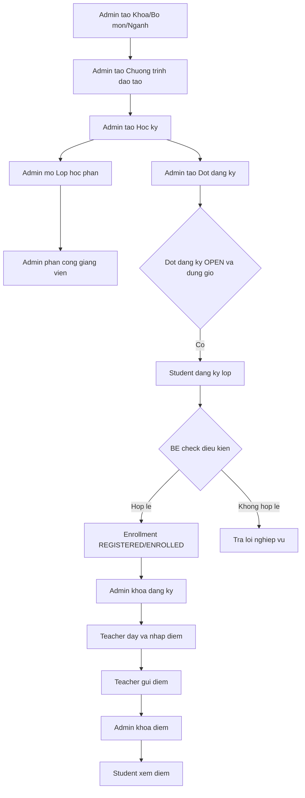

# Admin Modules Test Flow

Tai lieu nay dung cho FE/demo de test luong Admin University Portal theo workflow thuc te. Backend neu chua du API thi FE se fallback mock, con API/field thieu duoc ghi trong `frontend/docsforbeupdate/REGISTRATION_API_GAPS.md`.

## Tai khoan test

- Admin: `admin / password123`
- Student: `sv001 / password123`
- Teacher: `gv101 / password123`

## 1. Test tao khoa / bo mon / nganh

1. Dang nhap Admin.
2. Vao `/admin/faculties`.
3. Kiem tra danh sach Khoa hien thi: ma khoa, ten khoa, truong khoa, so bo mon, so nganh, so giang vien.
4. Vao `/admin/departments`.
5. Kiem tra Bo mon lien ket Faculty: faculty, head, teachers, majors, courses.
6. Vao `/admin/majors`.
7. Tao/sua/xoa nganh neu API san sang.
8. Neu API Khoa/Bo mon chua co, UI van hien mock va gaps nam trong `docsforbeupdate`.

Ket qua mong doi:

- Admin thay duoc cau truc `Faculty -> Department -> Major`.
- Major van lien ket duoc Course/Student/ClassSection nhu flow hien tai.

## 2. Test tao chuong trinh dao tao

1. Vao `/admin/curriculums`.
2. Chon/chuyen nganh hoc.
3. Kiem tra curriculum item co cac thong tin:
   - `majorId`
   - `courseId`
   - `suggestedSemester`
   - `academicYear`
   - `required/elective`
   - `credits`
4. Kiem tra so mon va tong tin chi theo chuong trinh.

Ket qua mong doi:

- FE hien CTDT theo nganh/nam hoc.
- Neu BE chua co API, FE suy ra tu Course/Major hoac mock.
- Backend sau nay dung CTDT de check mon sinh vien duoc phep dang ky va tien quyet.

## 3. Test tao hoc ky

1. Vao `/admin/semesters`.
2. Bam `Them hoc ky`.
3. Nhap ten hoc ky, ngay bat dau, ngay ket thuc.
4. Luu.
5. Sua hoc ky vua tao.
6. Xoa neu khong co lop hoc phan lien ket.

Ket qua mong doi:

- List hoc ky invalidate va cap nhat sau create/update/delete.
- Hoc ky dung lam context cho class section, registration period, timetable, reports.

## 4. Test tao dot dang ky

1. Vao `/admin/registration-periods`.
2. Kiem tra field mong doi:
   - `semesterId`
   - `name`
   - `startTime`
   - `endTime`
   - `status`: `DRAFT`, `OPEN`, `CLOSED`
3. Tao dot dang ky cho hoc ky hien tai neu API co.
4. Neu chua co API, bam action demo de mo/khoa dang ky.

Ket qua mong doi:

- Dot dang ky lien ket Semester.
- FE co the demo trang thai DRAFT/OPEN/CLOSED.

## 5. Test mo dang ky dung gio

1. Dat registration period status = `OPEN`.
2. Dat `startTime <= current time <= endTime`.
3. Dang nhap Student.
4. Vao `/student/course-registration`.
5. Kiem tra student thay hoc ky dang mo va co nut dang ky.
6. Chuyen period sang `CLOSED` hoac het `endTime`.
7. Kiem tra student khong the them/huy mon.

Ket qua mong doi:

- Dieu kien mo dang ky dua tren `status = OPEN` va server time nam trong khoang `startTime/endTime`.
- Neu BE chua co active-period API, FE demo bang mock/registrationOpen.

## 6. Test tao lop hoc phan

1. Vao `/admin/class-sections`.
2. Tao lop hoc phan voi:
   - course
   - semester
   - teacher
   - room
   - schedule
   - maxSlots
   - status
3. Sua giang vien/phong/lich/si so/status.
4. Xoa lop neu chua co sinh vien.
5. Huy lop neu da co sinh vien.

Ket qua mong doi:

- Lop hoc phan lien ket Course, Semester, Teacher, Room, Period.
- FE check trung lich phong/giang vien tam thoi, BE can validate that.

## 7. Test xem thoi khoa bieu

1. Vao `/admin/timetables`.
2. Loc theo hoc ky.
3. Kiem tra lich hien theo:
   - class section
   - course
   - teacher
   - room
   - dayOfWeek
   - startPeriod/endPeriod
4. Dang nhap Student, vao `/student/schedule`.
5. Dang nhap Teacher, vao `/teacher/classes` hoac schedule neu co.

Ket qua mong doi:

- Admin xem tong lich theo hoc ky.
- Student/Teacher chi thay lich lien quan den enrollment/assignment cua minh.
- Neu BE chua co timetable API rieng, FE dung ClassSection schedules.

## 8. Test phan cong giang vien

1. Vao `/admin/teaching-assignments`.
2. Chon hoc ky.
3. Chon class section.
4. Doi teacher phu trach.
5. Kiem tra canh bao trung lich giang vien truoc khi luu.
6. Luu.

Ket qua mong doi:

- Assignment lien ket `teacherId`, `classSectionId`, `semesterId`.
- Neu BE chua co API rieng, FE dung tam `teacherId` trong ClassSection update.

## 9. Test student dang ky hoc

1. Dang nhap `sv001`.
2. Vao `/student/course-registration`.
3. Chon hoc ky dang OPEN.
4. Bam Dang ky lop hoc phan.
5. BE can check:
   - trung lich
   - tien quyet
   - si so
   - gioi han tin chi
   - duplicate course/class
6. Kiem tra lop hien trong danh sach da dang ky.

Ket qua mong doi:

- Enrollment thanh `REGISTERED` hoac `ENROLLED` theo model BE.
- Neu loi nghiep vu, FE hien message ro.

## 10. Test admin khoa dang ky

1. Dang nhap Admin.
2. Vao `/admin/enrollments` hoac `/admin/registration-periods`.
3. Khoa dang ky theo hoc ky/dot.
4. Kiem tra class roster da chot.
5. Dang nhap Student va thu them/huy mon.

Ket qua mong doi:

- Student khong the them/huy sau khi khoa.
- Enrollment va si so lop duoc chot.
- Teacher co danh sach lop de day/nhap diem.

## 11. Test teacher nhap diem

1. Dang nhap `gv101`.
2. Vao `/teacher/grades`.
3. Chon lop hoc phan da chot.
4. Nhap diem chuyen can, giua ky, cuoi ky.
5. Luu/gửi diem.

Ket qua mong doi:

- Diem duoc luu theo enrollment.
- Teacher chi sua diem khi bang diem chua locked.

## 12. Test admin khoa diem

1. Dang nhap Admin.
2. Vao `/admin/academic-results` hoac `/admin/workflow`.
3. Chon hoc ky/class section.
4. Khoa diem.
5. Dang nhap Teacher va thu sua diem.
6. Dang nhap Student va xem ket qua hoc tap.

Ket qua mong doi:

- Teacher khong sua duoc diem sau khi locked.
- Student xem diem chinh thuc.
- Bao cao ket qua hoc tap cap nhat.

## Mermaid workflow

