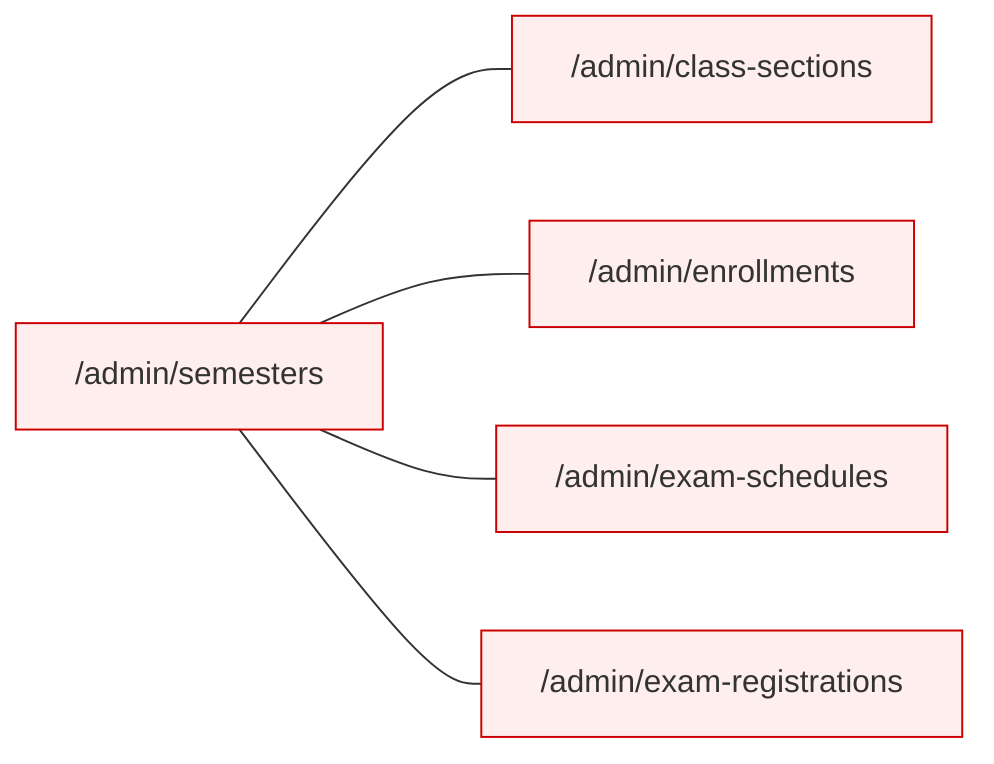
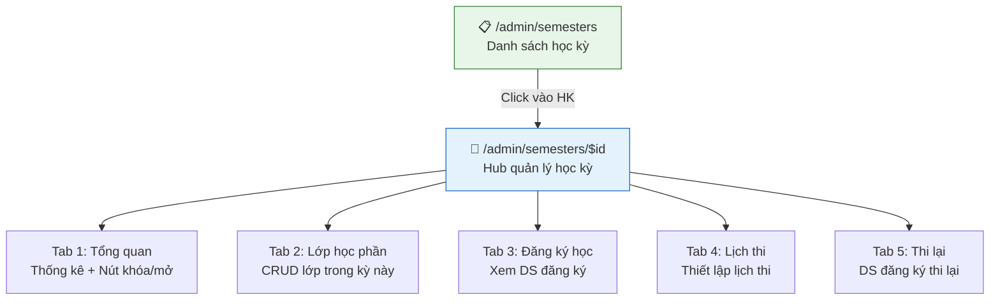
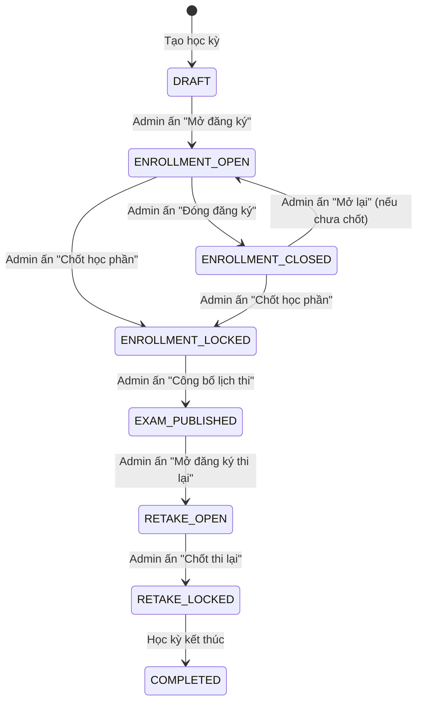
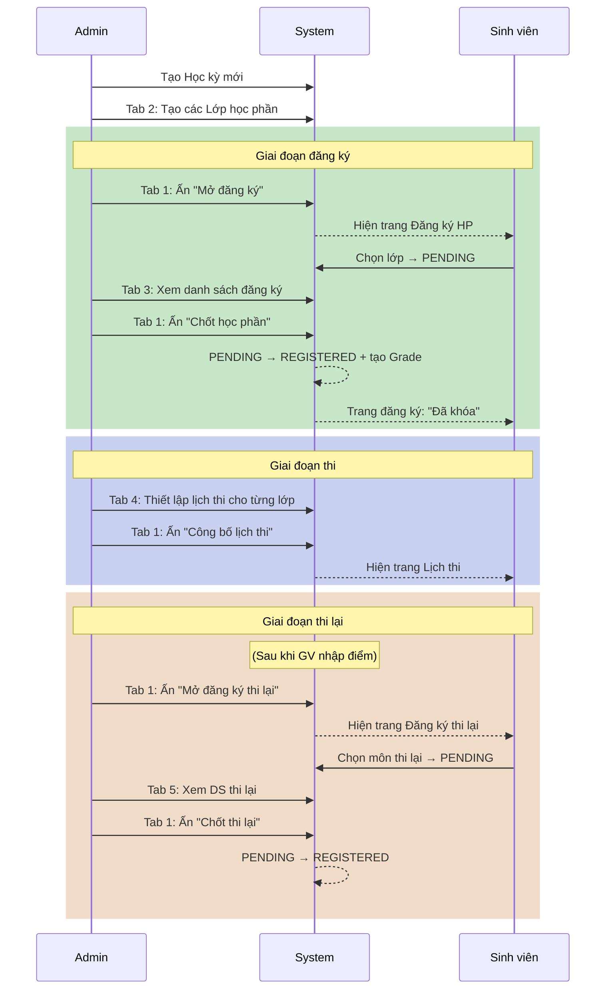

# Thiết kế lại Quản lý Đào tạo — Semester-Centric Hub

## Vấn đề hiện tại

Hiện tại có **5 trang admin tách rời** — mỗi trang quản lý một khía cạnh nhưng không có ngữ cảnh chung:



**Vấn đề:**
- Admin phải nhảy giữa 5 trang riêng biệt
- Không có tổng quan "trong kỳ này có gì đang diễn ra"
- Khó kiểm soát lifecycle mở/đóng/khóa theo tuần tự
- Lớp học phần hiện load tất cả các kỳ cùng lúc, không lọc theo semester

---

## Thiết kế mới: Semester Hub

### Ý tưởng chính

**Gộp tất cả vào 1 trang chính** `/admin/semesters` với **2 cấp**:

| Cấp | Route | Mô tả |
|-----|-------|-------|
| **Danh sách** | `/admin/semesters` | Xem tất cả học kỳ + CRUD |
| **Chi tiết** | `/admin/semesters/$id` | Hub quản lý 1 học kỳ cụ thể (5 tabs) |



---

### Sidebar thay đổi

**Trước (5 items riêng lẻ):**
```
Quản lý lớp
├── Học kỳ
├── Lớp học phần      ← xóa
├── Đăng ký học        ← xóa
├── Lịch thi           ← xóa
└── Đăng ký thi lại    ← xóa
```

**Sau (gộp vào 1):**
```
Đào tạo
└── Quản lý học kỳ     ← 1 entry duy nhất
```

> [!TIP]
> Khi click vào "Quản lý học kỳ", hiện danh sách học kỳ. Click vào 1 học kỳ → mở Hub chi tiết với 5 tabs. Mọi thứ liên quan đến 1 học kỳ đều nằm trong 1 trang.

---

## Wireframe chi tiết

### 1. Trang danh sách học kỳ `/admin/semesters`

```
┌──────────────────────────────────────────────────────────────────┐
│  📅 Quản lý Học kỳ                              [+ Thêm học kỳ] │
│  Danh sách tất cả học kỳ trong hệ thống                         │
├──────────────────────────────────────────────────────────────────┤
│                                                                  │
│  ┌─────────────────────────────────────────────────────────────┐ │
│  │ Học kỳ 1 — 2024-2025                                       │ │
│  │ 02/09/2024 → 15/01/2025                                    │ │
│  │                                                             │ │
│  │ ┌───────────┐ ┌───────────┐ ┌───────────┐ ┌─────────────┐  │ │
│  │ │ 45 lớp HP │ │ 1200 SV   │ │ Đăng ký:  │ │ Lịch thi:   │  │ │
│  │ │           │ │ đăng ký   │ │ 🔒 KHÓA  │ │ ✅ Đã công bố│  │ │
│  │ └───────────┘ └───────────┘ └───────────┘ └─────────────┘  │ │
│  │                                                             │ │
│  │ [Quản lý →]                          [✏️ Sửa]  [🗑️ Xóa]  │ │
│  └─────────────────────────────────────────────────────────────┘ │
│                                                                  │
│  ┌─────────────────────────────────────────────────────────────┐ │
│  │ Học kỳ 2 — 2024-2025                                       │ │
│  │ 03/02/2025 → 15/06/2025                                    │ │
│  │                                                             │ │
│  │ ┌───────────┐ ┌───────────┐ ┌───────────┐ ┌─────────────┐  │ │
│  │ │ 38 lớp HP │ │ 0 SV      │ │ Đăng ký:  │ │ Lịch thi:   │  │ │
│  │ │           │ │ đăng ký   │ │ 🟢 ĐANG MỞ│ │ ⏳ Chưa có   │  │ │
│  │ └───────────┘ └───────────┘ └───────────┘ └─────────────┘  │ │
│  │                                                             │ │
│  │ [Quản lý →]                          [✏️ Sửa]  [🗑️ Xóa]  │ │
│  └─────────────────────────────────────────────────────────────┘ │
│                                                                  │
└──────────────────────────────────────────────────────────────────┘
```

**Tính năng:**
- Card-based layout, mỗi học kỳ là 1 card
- Hiển thị thống kê nhanh: số lớp HP, số SV đăng ký, trạng thái đăng ký, trạng thái lịch thi
- **[Quản lý →]** → navigate sang `/admin/semesters/$id`
- **[+ Thêm học kỳ]** → Dialog tạo mới
- **[Sửa]** → Dialog sửa tên/ngày
- **[Xóa]** → Confirm dialog (chỉ cho xóa khi chưa có lớp HP)

---

### 2. Trang Hub chi tiết học kỳ `/admin/semesters/$id`

```
┌──────────────────────────────────────────────────────────────────────┐
│  ← Quay lại          Học kỳ 2 — 2024-2025                          │
│                       03/02/2025 → 15/06/2025                       │
├──────────────────────────────────────────────────────────────────────┤
│                                                                      │
│  ┌──────────┐ ┌──────────────┐ ┌──────────────┐ ┌────────┐ ┌──────┐ │
│  │ Tổng quan│ │ Lớp học phần │ │ Đăng ký học  │ │Lịch thi│ │Thi lại│ │
│  └──────────┘ └──────────────┘ └──────────────┘ └────────┘ └──────┘ │
│  ═══════════                                                         │
│                                                                      │
│   (Nội dung tab active hiển thị ở đây)                              │
│                                                                      │
└──────────────────────────────────────────────────────────────────────┘
```

---

#### Tab 1: Tổng quan (Overview Dashboard)

```
┌──────────────────────────────────────────────────────────────────┐
│  TỔNG QUAN HỌC KỲ                                               │
│                                                                  │
│  ┌──────────┐  ┌──────────┐  ┌──────────┐  ┌──────────┐        │
│  │    38    │  │   1,200  │  │    960   │  │    45    │        │
│  │ Lớp HP  │  │ SV đăng  │  │ Đã chốt  │  │ Thi lại  │        │
│  └──────────┘  └──────────┘  └──────────┘  └──────────┘        │
│                                                                  │
│  ── Quản lý trạng thái ──────────────────────────────────────── │
│                                                                  │
│  1. Đăng ký học phần                                             │
│     ┌─────────────────────────────────────────────────────────┐  │
│     │ Trạng thái: 🟢 ĐANG MỞ                                 │  │
│     │                                                         │  │
│     │ [🔓 Đóng đăng ký]      [🔒 Chốt học phần]             │  │
│     │                                                         │  │
│     │ ⚠️ Khi chốt: Tất cả PENDING → REGISTERED,             │  │
│     │    tạo Grade cho mỗi SV, khóa không cho đăng ký thêm   │  │
│     └─────────────────────────────────────────────────────────┘  │
│                                                                  │
│  2. Lịch thi                                                     │
│     ┌─────────────────────────────────────────────────────────┐  │
│     │ Trạng thái: ⏳ CHƯA CÔNG BỐ                            │  │
│     │ 20/38 lớp đã có lịch thi                                │  │
│     │                                                         │  │
│     │ [📢 Công bố lịch thi]                                  │  │
│     │                                                         │  │
│     │ ℹ️ Khi công bố: Sinh viên sẽ thấy lịch thi             │  │
│     │    trên trang Lịch thi                                  │  │
│     └─────────────────────────────────────────────────────────┘  │
│                                                                  │
│  3. Đăng ký thi lại / Nâng điểm                                 │
│     ┌─────────────────────────────────────────────────────────┐  │
│     │ Trạng thái: 🔴 CHƯA MỞ                                │  │
│     │                                                         │  │
│     │ [🟢 Mở đăng ký thi lại]    [🔒 Chốt thi lại]         │  │
│     │                                                         │  │
│     │ ℹ️ Khi chốt: Tất cả PENDING → REGISTERED,             │  │
│     │    tạo Enrollment + Grade mới cho thi lại               │  │
│     └─────────────────────────────────────────────────────────┘  │
│                                                                  │
└──────────────────────────────────────────────────────────────────┘
```

---

#### Tab 2: Lớp học phần (Class Sections)

Giống trang `/admin/class-sections` hiện tại nhưng **auto-filter theo semester**:

```
┌──────────────────────────────────────────────────────────────────┐
│  LỚP HỌC PHẦN — Học kỳ 2 (2024-2025)          [+ Thêm lớp HP] │
│  38 lớp học phần                                                 │
├──────────────────────────────────────────────────────────────────┤
│  🔍 Tìm kiếm...                                                 │
│                                                                  │
│  ┌──────┬──────────┬────────┬──────────┬─────┬───────┬────────┐ │
│  │ Mã   │ Môn học  │ GV     │ Lịch     │SV   │Trạng  │        │ │
│  │ lớp  │          │        │          │hiện  │thái   │        │ │
│  ├──────┼──────────┼────────┼──────────┼─────┼───────┼────────┤ │
│  │IT101 │Java Core │Nguyễn  │T2 tiết   │42/  │ OPEN  │[👁][✏] │ │
│  │.N1   │          │Văn A   │1-3, P201 │50   │       │[🗑]    │ │
│  ├──────┼──────────┼────────┼──────────┼─────┼───────┼────────┤ │
│  │IT101 │Java Core │Trần    │T4 tiết   │38/  │ OPEN  │[👁][✏] │ │
│  │.N2   │          │Thị B   │1-3, P305 │50   │       │[🗑]    │ │
│  ├──────┼──────────┼────────┼──────────┼─────┼───────┼────────┤ │
│  │IT202 │Database  │Lê      │T3 tiết   │50/  │ CLOSED│[👁][✏] │ │
│  │.N1   │Systems   │Văn C   │4-6, P102 │50   │       │[🗑]    │ │
│  └──────┴──────────┴────────┴──────────┴─────┴───────┴────────┘ │
│                                                                  │
│  👁 = Xem danh sách SV    ✏ = Sửa    🗑 = Xóa                  │
└──────────────────────────────────────────────────────────────────┘
```

**Thay đổi so với hiện tại:**
- Luôn lọc theo semester đang xem (không còn dropdown chọn semester)
- Thêm cột "SV hiện tại" (currentSlots/maxSlots)
- Giữ nguyên logic CRUD đã có
- Khi tạo mới, auto-fill semesterId = semester đang xem

---

#### Tab 3: Đăng ký học (Enrollments)

```
┌──────────────────────────────────────────────────────────────────┐
│  ĐĂNG KÝ HỌC PHẦN — Học kỳ 2 (2024-2025)                      │
│  1,200 đăng ký · 960 đã chốt · 240 đang chờ                    │
├──────────────────────────────────────────────────────────────────┤
│                                                                  │
│  Trạng thái:  [Tất cả ▾]   Lớp HP:  [Tất cả ▾]                │
│  🔍 Tìm theo tên SV, mã SV, tên môn...                         │
│                                                                  │
│  ┌────────────┬──────────┬──────────┬──────────┬───────────────┐ │
│  │ Sinh viên  │ Lớp HP   │ Môn học  │ Tín chỉ │ Trạng thái    │ │
│  ├────────────┼──────────┼──────────┼──────────┼───────────────┤ │
│  │ Nguyễn A   │ IT101.N1 │ Java     │ 3       │ ⏳ PENDING    │ │
│  │ SV001      │          │ Core     │         │               │ │
│  ├────────────┼──────────┼──────────┼──────────┼───────────────┤ │
│  │ Trần B     │ IT202.N1 │ Database │ 4       │ ✅ REGISTERED │ │
│  │ SV002      │          │ Systems  │         │               │ │
│  └────────────┴──────────┴──────────┴──────────┴───────────────┘ │
│                                                                  │
│  ──── Đăng ký hộ sinh viên ────                                  │
│  [+ Override: Đăng ký hộ SV (bỏ qua sĩ số)]                    │
│                                                                  │
│  Phân trang: ◀ 1 2 3 ... 12 ▶  ·  20 dòng/trang               │
└──────────────────────────────────────────────────────────────────┘
```

**Tính năng:**
- Gọi API thực: `GET /api/admin/enrollments?semesterId=X`
- Server-side pagination
- Filter theo status + classSection
- Nút "Override" để admin đăng ký hộ SV (bypass sĩ số)

---

#### Tab 4: Lịch thi (Exam Schedules)

```
┌──────────────────────────────────────────────────────────────────┐
│  LỊCH THI — Học kỳ 2 (2024-2025)               [📢 Công bố]    │
│  20/38 lớp đã có lịch thi                                       │
├──────────────────────────────────────────────────────────────────┤
│                                                                  │
│  Hiển thị: [Tất cả ▾]  [Chưa có lịch ▾]                        │
│                                                                  │
│  ┌──────────┬──────────┬──────┬────────────────┬───────┬──────┐ │
│  │ Mã lớp   │ Môn học  │ SV   │ Ngày thi       │ Phòng │      │ │
│  ├──────────┼──────────┼──────┼────────────────┼───────┼──────┤ │
│  │ IT101.N1 │ Java     │ 42   │ 15/01/2025     │ P201  │ [✏] │ │
│  │          │ Core     │      │ 08:00 - 10:00  │       │      │ │
│  ├──────────┼──────────┼──────┼────────────────┼───────┼──────┤ │
│  │ IT101.N2 │ Java     │ 38   │ 15/01/2025     │ P305  │ [✏] │ │
│  │          │ Core     │      │ 08:00 - 10:00  │       │      │ │
│  ├──────────┼──────────┼──────┼────────────────┼───────┼──────┤ │
│  │ IT202.N1 │ Database │ 50   │ ⚠️ Chưa có     │  —    │ [✏] │ │
│  │          │ Systems  │      │                │       │      │ │
│  └──────────┴──────────┴──────┴────────────────┴───────┴──────┘ │
│                                                                  │
│  [✏] → Dialog chọn ngày giờ thi + phòng thi                     │
│                                                                  │
│  ⚠️ Xung đột: IT101.N1 và IT202.N1 cùng phòng P201             │
│     ngày 15/01 08:00 (nếu có)                                   │
└──────────────────────────────────────────────────────────────────┘
```

**Tính năng:**
- Hiển thị tất cả lớp HP trong kỳ + lịch thi (nếu có)
- Inline edit hoặc dialog để set examAt + examRoom cho từng lớp
- Kiểm tra xung đột phòng thi cùng thời điểm
- Nút **[📢 Công bố]** → đánh dấu lịch thi đã công bố (SV mới thấy)
- Filter: Chưa có lịch / Đã có lịch / Tất cả

---

#### Tab 5: Đăng ký thi lại (Retake Registrations)

```
┌──────────────────────────────────────────────────────────────────┐
│  ĐĂNG KÝ THI LẠI — Học kỳ 2 (2024-2025)                        │
│  45 đăng ký · 12 PENDING · 33 REGISTERED                        │
├──────────────────────────────────────────────────────────────────┤
│                                                                  │
│  ┌──────────┐  ┌──────────┐  ┌──────────┐                      │
│  │    45    │  │  12      │  │  9.000k  │                      │
│  │ Tổng ĐK │  │ Chờ chốt │  │ Tổng phí │                      │
│  └──────────┘  └──────────┘  └──────────┘                      │
│                                                                  │
│  Trạng thái: [Tất cả ▾]   Loại: [Tất cả ▾]                    │
│                                                                  │
│  ┌──────────┬──────────┬──────────┬──────┬──────┬──────────────┐│
│  │ Sinh viên│ Môn học  │ Loại     │ Lần │ Phí  │ Trạng thái   ││
│  ├──────────┼──────────┼──────────┼──────┼──────┼──────────────┤│
│  │ Nguyễn A │ Java     │ Thi lại  │ 2   │ 200k │ ⏳ PENDING   ││
│  │ SV001    │ Core     │          │     │      │              ││
│  ├──────────┼──────────┼──────────┼──────┼──────┼──────────────┤│
│  │ Trần B   │ Database │ Nâng điểm│ 2   │ 200k │ ✅ REGISTERED││
│  │ SV002    │ Systems  │          │     │      │              ││
│  └──────────┴──────────┴──────────┴──────┴──────┴──────────────┘│
│                                                                  │
└──────────────────────────────────────────────────────────────────┘
```

---

## Lifecycle & Lock Controls

### Luồng quản lý học kỳ (Semester Lifecycle)



### Bảng trạng thái & hiển thị bên sinh viên

| Trạng thái học kỳ | Sinh viên thấy gì |
|---|---|
| **DRAFT** | Không thấy gì |
| **ENROLLMENT_OPEN** | Trang "Đăng ký học phần" hiện lớp HP để đăng ký |
| **ENROLLMENT_CLOSED / LOCKED** | Trang đăng ký hiện "Đã đóng", chỉ xem |
| **EXAM_PUBLISHED** | Trang "Lịch thi" hiện lịch thi |
| **RETAKE_OPEN** | Trang "Đăng ký thi lại" hiện môn đủ ĐK |
| **RETAKE_LOCKED** | Trang thi lại hiện "Đã chốt", chỉ xem |

> [!IMPORTANT]
> **Quyết định thiết kế cần xác nhận:**
> Hiện tại Semester entity chỉ có 2 field boolean: `isRegistrationOpen` + `isLocked`.
> Để hỗ trợ lifecycle đầy đủ hơn, có 2 lựa chọn:
>
> **Phương án A (Đơn giản — Gợi ý):** Giữ nguyên 2 field hiện tại + thêm 2 field mới:
> - `examPublished` (boolean) — lịch thi đã công bố chưa
> - `retakeOpen` (boolean) — đăng ký thi lại đang mở
> - `retakeLocked` (boolean) — đã chốt thi lại
>
> **Phương án B (Enum):** Thay thế bằng 1 field `semesterStatus` enum:
> `DRAFT | ENROLLMENT_OPEN | ENROLLMENT_LOCKED | EXAM_PUBLISHED | RETAKE_OPEN | RETAKE_LOCKED | COMPLETED`
> - Ưu: Rõ ràng, tuần tự
> - Nhược: Cứng nhắc hơn, khó skip bước

---

## Proposed Changes

### Backend

---

#### [MODIFY] [Semester.java](file:///d:/universityweb/backend/src/main/java/com/example/ThangLongUniversityWeb/entity/Semester.java)

Thêm fields mới cho lifecycle:
```java
// Thêm:
private boolean examPublished = false;  // Lịch thi đã công bố
private boolean retakeOpen = false;     // Đăng ký thi lại đang mở
private boolean retakeLocked = false;   // Đã chốt thi lại
```

#### [MODIFY] [SemesterService.java](file:///d:/universityweb/backend/src/main/java/com/example/ThangLongUniversityWeb/service/SemesterService.java)

Thêm các action methods:
```java
toggleRegistration(Long id, boolean open)     // Mở/đóng đăng ký
lockEnrollments(Long id)                      // Chốt học phần → PENDING→REGISTERED
publishExamSchedules(Long id)                 // Công bố lịch thi
toggleRetakeRegistration(Long id, boolean open) // Mở/đóng thi lại
lockRetakes(Long id)                          // Chốt thi lại
getSemesterSummary(Long id)                   // Thống kê tổng hợp cho Tab Tổng quan
```

#### [MODIFY] [SemesterManagementController.java](file:///d:/universityweb/backend/src/main/java/com/example/ThangLongUniversityWeb/controller/SemesterManagementController.java)

Thêm endpoints cho lifecycle actions:
```java
POST /api/admin/semesters/{id}/toggle-registration     // req: {open: boolean}
POST /api/admin/semesters/{id}/lock-enrollments
POST /api/admin/semesters/{id}/publish-exams
POST /api/admin/semesters/{id}/toggle-retake            // req: {open: boolean}
POST /api/admin/semesters/{id}/lock-retakes
GET  /api/admin/semesters/{id}/summary                  // Thống kê tổng quan
```

#### [NEW] SemesterSummaryResponse.java

```java
public class SemesterSummaryResponse {
    private Long semesterId;
    private String name;
    private int classSectionCount;
    private int enrollmentCount;
    private int pendingEnrollments;
    private int registeredEnrollments;
    private int examScheduledCount;
    private int examNotScheduledCount;
    private int retakeRegistrations;
    private int retakePending;
    // + các field trạng thái
    private boolean registrationOpen;
    private boolean locked;
    private boolean examPublished;
    private boolean retakeOpen;
    private boolean retakeLocked;
}
```

#### [MODIFY] [ClassSectionManagementController.java](file:///d:/universityweb/backend/src/main/java/com/example/ThangLongUniversityWeb/controller/ClassSectionManagementController.java)

Thêm/cập nhật endpoints:
```java
// Đã có nhưng cần dùng:
GET  /api/admin/class-sections/semester/{semesterId}

// Thêm mới:
PUT  /api/admin/class-sections/{id}/exam-schedule       // Set examAt + examRoom
GET  /api/admin/class-sections/semester/{semesterId}/exam-schedules
PUT  /api/admin/class-sections/semester/{semesterId}/exam-schedules  // Batch
```

#### [NEW] AdminExamRegistrationController.java

```java
GET /api/admin/exam-registrations?semesterId=X&status=Y  // DS thi lại theo kỳ
GET /api/admin/exam-registrations/semester/{id}/summary   // Thống kê thi lại
```

#### [MODIFY] [AdminEnrollmentService.java](file:///d:/universityweb/backend/src/main/java/com/example/ThangLongUniversityWeb/service/AdminEnrollmentService.java)

Di chuyển logic `lockPendingEnrollments` và `lockPendingRetakes` vào SemesterService (vì giờ mọi action đều semester-centric).

#### [MODIFY] Cập nhật Student API responses

Sinh viên cần biết các trạng thái mới để ẩn/hiện UI:
- `StudentSemesterResponse` thêm: `examPublished`, `retakeOpen`, `retakeLocked`
- Trang student "Lịch thi" chỉ hiện khi `examPublished = true`
- Trang student "Đăng ký thi lại" chỉ hiện khi `retakeOpen = true`

---

### Frontend

---

#### [MODIFY] [AppLayout.tsx](file:///d:/universityweb/frontend/src/components/layout/AppLayout.tsx)

Cập nhật sidebar admin:
```typescript
// Thay thế group "Quản lý lớp" (5 items) bằng:
{
  heading: "Đào tạo",
  items: [
    { to: "/admin/semesters", label: "Quản lý học kỳ", icon: CalendarDays },
  ],
}
```

#### [MODIFY] [admin.semesters.tsx](file:///d:/universityweb/frontend/src/routes/admin.semesters.tsx)

Viết lại thành trang danh sách card-based:
- Card cho mỗi semester với thống kê nhanh
- Nút "Quản lý" → navigate sang `/admin/semesters/$id`
- Dialog tạo mới / sửa semester
- Nút xóa với confirm

#### [NEW] admin.semesters.$id.tsx

Route file mới cho semester detail hub:
```
d:\universityweb\frontend\src\routes\admin.semesters.$id.tsx
```

Trang chi tiết semester với 5 tabs:
- **Tab Tổng quan**: Dashboard cards + lock/unlock controls
- **Tab Lớp học phần**: Reuse component từ `admin-class-sections` feature, auto-filter by semesterId
- **Tab Đăng ký học**: Gọi API thực, server-side pagination, filter
- **Tab Lịch thi**: Bảng exam schedules + inline edit
- **Tab Thi lại**: DS exam registrations

#### [NEW] Feature module: `features/semester-hub/`

```
features/semester-hub/
├── SemesterHubContent.tsx       # Main hub component với tabs
├── OverviewTab.tsx              # Tab 1: Dashboard + controls
├── ClassSectionsTab.tsx         # Tab 2: Reuse existing class section components
├── EnrollmentsTab.tsx           # Tab 3: Enrollment list
├── ExamSchedulesTab.tsx         # Tab 4: Exam schedule management
├── RetakeRegistrationsTab.tsx   # Tab 5: Retake registrations
├── SemesterFormDialog.tsx       # Dialog tạo/sửa semester
└── types.ts                     # Types for this feature
```

#### [MODIFY] [admin.ts](file:///d:/universityweb/frontend/src/lib/api/admin.ts)

Thêm API functions mới:
```typescript
// Semester lifecycle
createSemester: (request) => ...,
toggleRegistration: (semesterId, open: boolean) => ...,
lockEnrollments: (semesterId) => ...,
publishExamSchedules: (semesterId) => ...,
toggleRetakeRegistration: (semesterId, open: boolean) => ...,
lockRetakes: (semesterId) => ...,
getSemesterSummary: (semesterId) => ...,

// Enrollments (đã có search, thêm vào)
listEnrollments: (params) => ...,
overrideEnrollment: (request) => ...,

// Exam schedules
getExamSchedules: (semesterId) => ...,
updateExamSchedule: (classSectionId, request) => ...,
batchUpdateExamSchedules: (semesterId, requests) => ...,

// Exam registrations
listExamRegistrations: (params) => ...,
getExamRegistrationSummary: (semesterId) => ...,
```

#### [MODIFY] [types.ts](file:///d:/universityweb/frontend/src/lib/api/types.ts)

Thêm types:
```typescript
interface StudentSemesterResponse {
  // existing fields...
  examPublished: boolean;    // NEW
  retakeOpen: boolean;       // NEW
  retakeLocked: boolean;     // NEW
}

interface SemesterSummaryResponse { ... }
interface AdminEnrollmentResponse { ... }
interface ExamScheduleRequest { ... }
interface ExamScheduleResponse { ... }
interface AdminExamRegistrationResponse { ... }
// PageResponse<T> for pagination
```

#### [MODIFY] Student pages: Conditional visibility

- [student.course-registration.tsx](file:///d:/universityweb/frontend/src/routes/student.course-registration.tsx): Hiện tại đã check `registrationOpen` + `locked` → giữ nguyên
- [student.exams.tsx](file:///d:/universityweb/frontend/src/routes/student.exams.tsx): Thêm check `examPublished`, nếu chưa công bố → hiện "Lịch thi chưa được công bố"
- [student.retake-registration.tsx](file:///d:/universityweb/frontend/src/routes/student.retake-registration.tsx): Thêm check `retakeOpen`, nếu chưa mở → hiện "Chưa mở đăng ký thi lại"

#### [DELETE/DEPRECATE] Các route cũ

Các trang sau sẽ **redirect** về `/admin/semesters`:
- `/admin/class-sections` → `/admin/semesters` (gộp vào Tab 2)
- `/admin/enrollments` → `/admin/semesters` (gộp vào Tab 3)
- `/admin/exam-schedules` → `/admin/semesters` (gộp vào Tab 4)
- `/admin/exam-registrations` → `/admin/semesters` (gộp vào Tab 5)

> [!NOTE]
> Giữ route files nhưng chuyển thành redirect để không break URL cũ nếu ai đã bookmark.

---

## Luồng end-to-end sau khi thiết kế lại



---

## Open Questions

> [!NOTE]
> 1. **Phương án lifecycle**: Bạn chọn Phương án A (thêm boolean fields) hay Phương án B (enum status)? Tôi gợi ý Phương án A vì linh hoạt hơn.
> 2. **Lịch thi lại**: Lịch thi lại có riêng biệt với lịch thi thường không? Hay dùng chung `examAt`/`examRoom` trên ClassSection?
> 3. **Giới hạn tín chỉ**: Có muốn thêm giới hạn tối đa tín chỉ mỗi kỳ cho sinh viên không? (ví dụ: 25 TC/kỳ)
> 4. **Export**: Có cần export danh sách đăng ký / lịch thi ra Excel/CSV không?

---

## Verification Plan

### Build & Lint
```bash
cd frontend && npm run build    # Đảm bảo TypeScript không lỗi
cd backend && ./mvnw compile    # Đảm bảo Java compile
```

### Functional Testing

1. **Semester CRUD**: Tạo → Sửa → Xóa học kỳ
2. **Lifecycle flow**: Mở đăng ký → Sinh viên thấy → Đóng → Chốt
3. **Class sections in semester**: Tab 2 hiện đúng lớp HP theo kỳ
4. **Enrollments**: Tab 3 hiện dữ liệu thực từ API, pagination hoạt động
5. **Exam schedules**: Tab 4 set lịch thi → Công bố → SV thấy
6. **Retake**: Mở thi lại → SV đăng ký → Admin chốt
7. **Student visibility**: Kiểm tra SV chỉ thấy khi admin mở

### Browser Testing
- Mở Chrome DevTools: kiểm tra API calls đúng
- Test responsive trên mobile view

---

## Thứ tự thực hiện

| Phase | Task | Ưu tiên |
|-------|------|---------|
| 1 | Backend: Thêm fields Semester + lifecycle endpoints | 🔴 Cao |
| 2 | Frontend: Trang danh sách semesters (card-based) | 🔴 Cao |
| 3 | Frontend: Semester hub + Tab Tổng quan | 🔴 Cao |
| 4 | Frontend: Tab Lớp học phần (reuse existing) | 🟡 TB |
| 5 | Frontend: Tab Đăng ký học (real API) | 🟡 TB |
| 6 | Backend: Exam schedule endpoints | 🟡 TB |
| 7 | Frontend: Tab Lịch thi | 🟡 TB |
| 8 | Backend: Exam registration endpoints | 🟢 Thấp |
| 9 | Frontend: Tab Thi lại | 🟢 Thấp |
| 10 | Student pages: conditional visibility | 🟢 Thấp |
| 11 | Redirect old routes + cleanup | 🟢 Thấp |
